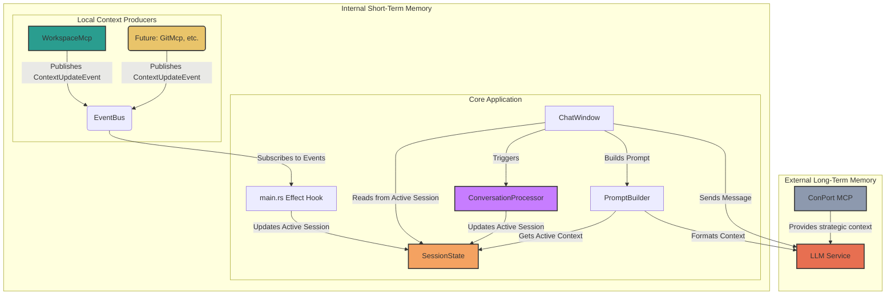

# Hobbes Architecture

This document outlines the software architecture for Hobbes, distinguishing between long-term and short-term memory systems.

## Core Principles

- **Local-First:** All user data, including chat history and context, is stored locally and securely on the user's machine.
- **Clear Memory Separation:** The system maintains a clear distinction between long-term strategic memory (managed by external MCPs like ConPort) and short-term, session-specific active context (managed internally).
- **Event-Driven Context:** Internal, short-term context is updated via an event bus, allowing for modular and scalable local context providers.

## System Components

The architecture is designed to integrate both external long-term memory and internal short-term memory seamlessly.

### 1. Memory Systems

-   **Long-Term Memory (ConPort):** An external MCP that provides access to the project's strategic memory, including goals, architectural decisions, and user preferences. This is analogous to a project's knowledge base.
-   **Short-Term Memory (`SessionState`):** The core of the "live" context. This is managed internally and stored securely in `sessions.json`. Each `Session` object within the state contains its own `active_context` map, ensuring that short-term memory is scoped to a specific conversation.

### 2. Local Context Producers & Processors

-   **`WorkspaceMcp`**: A provider that emits data about the user's local workspace (active file, open tabs). This is a key source for short-term memory, pushed via the Event Bus.
-   **`ConversationProcessor`**: An internal service triggered *after* a message is sent. It reads the recent conversation history, uses a fast LLM (e.g., Gemini Flash) to extract entities and summaries, and writes this data directly to the active session's `active_context`. This is the primary mechanism for conversational memory.
-   **(Future) `GitMcp`**: Will provide short-term context about the current Git branch and status.

### 3. Event Bus

-   A central `tokio::sync::broadcast` channel for internal communication from asynchronous producers like MCPs.
-   It decouples these producers from the core application, allowing them to publish `ContextUpdateEvent`s without needing direct access to the `SessionState`.

### 4. Session State (`session.rs`)

-   The single source of truth for all session-related data, including messages and the `active_context` map (`HashMap<String, serde_json::Value>`).
-   It is responsible for persisting this data to the filesystem, providing secure, local-first storage.

### 5. Prompt Builder

-   A utility that reads the `active_context` from the current `Session` within `SessionState`.
-   It formats this context map into a JSON string and wraps it in `<SYSTEM_CONTEXT>` tags for the LLM.

## Data Flow for Short-Term Context

The system uses two parallel flows to update short-term context:

**A) Event-Driven Context (e.g., Workspace changes):**
1.  A local producer (e.g., `WorkspaceMcp`) gathers context and publishes a `ContextUpdateEvent` to the `EventBus`.
2.  A `use_effect` hook in `main.rs` receives the event.
3.  The hook accesses the global `SessionState`, gets the currently active `Session`, and updates the `active_context` map.

**B) Conversational Context (The Race Condition Fix):**
1.  The user sends a message from the `ChatWindow`.
2.  The message is immediately added to the current `Session`'s message list.
3.  A single async task is spawned to handle the entire message processing flow sequentially, preventing race conditions:
    a. The `ConversationProcessor` is triggered. It reads the latest conversation history (including the new message) and generates an updated summary.
    b. The processor's summary is written back into the `active_context` map in the `SessionState`.
    c. **Only after the context is updated**, the `PromptBuilder` reads the fresh `active_context`.
    d. The builder formats the context and combines it with the user's message to create the final prompt, which is then sent to the LLM. This ensures the AI always has the most current context for every message.

This revised architecture correctly separates concerns and provides a robust mechanism for both ambient and conversational short-term memory.