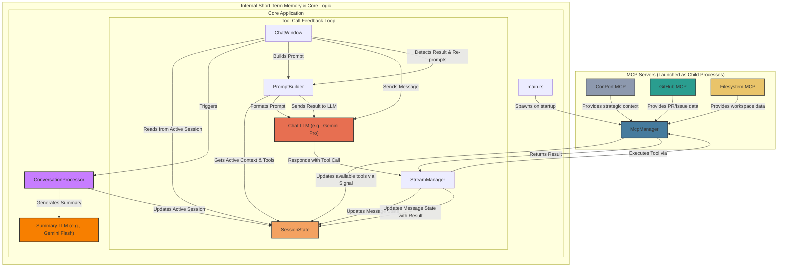

# Hobbes Architecture

This document outlines the software architecture for Hobbes, distinguishing between long-term and short-term memory systems.

## Core Principles

- **Local-First:** All user data, including chat history and context, is stored locally and securely on the user's machine.
- **Clear Memory Separation:** The system maintains a clear distinction between long-term strategic memory (managed by external MCPs like ConPort) and short-term, session-specific active context (managed internally).
- **Reactive State Management:** Internal, short-term context is managed via Dioxus Signals, a reactive state management library. This allows for efficient, declarative updates to the UI and application state without a manual event bus.

## System Components

The architecture is designed to integrate both external long-term memory and internal short-term memory seamlessly.

### 1. Memory Systems

-   **Local Long-Term Memory (ConPort):** A local MCP that provides access to the project's strategic memory, including goals, architectural decisions, and user preferences. This is analogous to a project's knowledge base.
-   **Short-Term Memory (`SessionState`):** The core of the "live" context. This is managed internally and stored securely in `sessions.json`. Each `Session` object within the state contains its own `active_context`, which is a strongly-typed `struct`. This ensures that short-term memory is type-safe and scoped to a specific conversation.
### 2. Local Context Producers & Processors

-   **`McpManager`**: A central service responsible for managing the lifecycle of all MCP servers. On application startup, it reads a configuration file (`mcp_servers.json`), launches each configured server as a child process, and communicates with it over standard I/O. It discovers the tools each server provides and updates the `SessionState` reactively via a Dioxus `Signal`.
-   **`ConversationProcessor`**: An internal service triggered *after* a message is sent. It reads the recent conversation history, uses a fast, dedicated **Summary LLM** (e.g., Gemini Flash) to extract entities and summaries, and writes this data directly to the active session's `active_context`. This is the primary mechanism for conversational memory, distinct from the main **Chat LLM**.

### 4. Session State (`session.rs`)

-   The single source of truth for all session-related data, including messages and the `active_context` struct.
-   It is responsible for persisting this data to the filesystem, providing secure, local-first storage.
### 5. Prompt Builder

-   A utility that reads the `active_context` from the current `Session` within `SessionState`.
-   It assembles the context, conversation history, and available MCP tools into a structured prompt object that is sent to the LLM service. It also performs crucial schema corrections to ensure compatibility with the LLM API.
## Data Flow for Short-Term Context

The system uses two parallel flows to update short-term context:

**A) Reactive MCP Context Loading:**
1.  On application startup, a `use_effect` hook in `main.rs` triggers the `McpManager` to launch all configured MCP servers.
2.  As each server connects and reports its available tools, the `McpManager` updates a global `McpContext` Dioxus `Signal`.
3.  A `use_effect` hook in `chat.rs` subscribes to this signal and updates the `active_context` in the current `Session` whenever the list of available tools changes.
**B) Conversational Context (The Race Condition Fix):**
1.  The user sends a message from the `ChatWindow`.
2.  The message is immediately added to the current `Session`'s message list.
3.  A single async task is spawned to handle the entire message processing flow sequentially, preventing race conditions:
    a. The `ConversationProcessor` is triggered. It reads the latest conversation history and uses the **Summary LLM** to generate an updated summary.
    b. The processor's summary is written back into the `active_context` map in the `SessionState`.
    c. **Only after the context is updated**, the `PromptBuilder` reads the fresh `active_context`.
    d. The builder formats the context and combines it with the user's message to create the final prompt, which is then sent to the LLM. This ensures the AI always has the most current context for every message.

This revised architecture correctly separates concerns and provides a robust mechanism for both ambient and conversational short-term memory, while clearly distinguishing between local and external context sources and the different LLM roles.

**C) Tool-Calling Context (The Inner Loop):**
1.  The `LLM Service`, having been provided a list of available tools by the `PromptBuilder`, responds with a structured request to call a tool.
2.  The `StreamManager` detects this request, updates the message in `SessionState` to a `ToolCall` type (triggering the UI to show a "using tool" state), and signals completion to the `chat_coroutine`.
3.  The `chat_coroutine` in `ChatWindow` receives the signal and executes the tool via the `McpManager`.
4.  Upon receiving the result, the coroutine uses the `PromptBuilder` to format the tool's output into a new `<SYSTEM_CONTEXT>` block.
5.  This new context is sent back to the `LLM Service` as a new message (which is hidden from the UI). This creates an inner loop, allowing the LLM to process the tool's result and continue its reasoning, potentially calling more tools if necessary.

### 6. Native UI Components

-   **Native Menu (`menu.rs`):** To ensure standard hotkeys (e.g., Copy, Paste, Quit) work as expected, the application initializes a native OS menu bar at startup. This is built using the `muda` crate and configured in `main.rs`.
-   **System Tray Icon (`tray.rs`):** The application features a system tray icon that allows the user to toggle the main window's visibility. The icon's presence is reactive and can be enabled or disabled in real-time from the settings panel. The lifecycle of the tray icon is managed by a Dioxus `use_effect` hook in `main.rs` that listens for changes to the relevant setting.