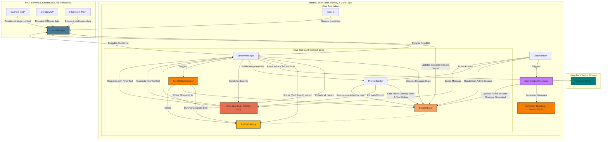

# Hobbes Architecture

This document outlines the software architecture for Hobbes, distinguishing between long-term and short-term memory systems.

## Core Principles

- **Local-First:** All user data, including chat history and context, is stored locally and securely on the user's machine.
- **Clear Memory Separation:** The system maintains a clear distinction between long-term strategic memory (managed by external MCPs like ConPort) and short-term, session-specific active context (managed internally).
- **Reactive State Management:** Internal, short-term context is managed via Dioxus Signals, a reactive state management library. This allows for efficient, declarative updates to the UI and application state without a manual event bus.

## System Components

The architecture is designed to integrate both external long-term memory and internal short-term memory seamlessly.


```mermaid
graph TD
    subgraph "MCP Servers (Launched as Child Processes)"
        A[ConPort MCP] -- "Provides strategic context" --> L;
        B[GitHub MCP] -- "Provides PR/Issue data" --> L;
        C[Filesystem MCP] -- "Provides workspace data" --> L;
    end

    subgraph "Long-Term Vector Storage"
        V[DocumentStore]
        style V fill:#008080,stroke:#333,stroke-width:2px
    end

    subgraph "Internal Short-Term Memory & Core Logic"
        subgraph "Core Application"
            M[main.rs] -->|Spawns on startup| L[McpManager];
            L -->|Updates available tools via Signal| F[SessionState];
            
            G[ChatWindow] -->|Reads from Active Session| F;
            G -->|Triggers| J[ConversationProcessor];
            J -->|"Updates Active Session (Dialogue Summary)"| F;

            G -->|Builds Prompt| H[PromptBuilder];
            H -->|Gets Active Context, Tools & Tool History| F;
            H -->|Formats Prompt| I["Chat LLM (e.g., Gemini Pro)"];
            G -- "Sends Message" --> I;

            J -- "Generates Summary" --> I2["Summary LLM (e.g., Gemini Flash)"];

            subgraph "NEW Tool Call Feedback Loop"
                I -- "Responds with Tool Call" --> K[StreamManager];
                K -- "Updates Message State" --> F;
                K -- "Executes Tool(s) via" --> L;
                L -- "Returns Result(s)" --> K;
                K -- "Collects all results" --> K;
                K -- "Stores (Call, Result) pairs in" --> TCH[ToolCallHistory];
                K -- "Async write of full results to" --> V;
                K -- "Builds new prompt via" --> H;
                H -- "Gets context & history from" --> F;
                K -- "Sends feedback to" --> I;

                I -- "Responds with Final Text" --> K;
                K -- "Triggers" --> TCS[ToolCallSummarizer];
                TCS -- "Summarizes pairs from" --> TCH;
                TCS -- "Writes 'Snapshot' to" --> F;
                TCS -- "Clears" --> TCH;
            end
        end
    end

    F -.-> TCH;
    style TCH fill:#ffb703,stroke:#333,stroke-width:2px
    style TCS fill:#fb8500,stroke:#333,stroke-width:2px
    style J fill:#c77dff,stroke:#333,stroke-width:2px
    style F fill:#f4a261,stroke:#333,stroke-width:2px
    style I fill:#e76f51,stroke:#333,stroke-width:2px
    style I2 fill:#f77f00,stroke:#333,stroke-width:2px
    style L fill:#457b9d,stroke:#333,stroke-width:2px
```

### 1. Memory & State

-   **Local Long-Term Memory (ConPort):** A local MCP that provides access to the project's strategic memory, including goals, architectural decisions, and user preferences. This is analogous to a project's knowledge base.
-   **Vector Storage (`DocumentStore`):** A long-term, asynchronous storage solution (e.g., using Qdrant). It ingests and indexes the full, verbose content from tool call responses and user-uploaded documents for Retrieval Augmented Generation (RAG).
-   **Short-Term Memory (`SessionState`):** The core of the "live" context. This is managed internally and stored securely in `sessions.json`. Each `Session` object within the state contains its own `active_context`, which is a strongly-typed `struct`. It also contains the `tool_call_history`, a short-lived list for in-flight tool interactions.

### 2. Core Services & Processors

-   **`McpManager`**: A central service responsible for managing the lifecycle of all MCP servers. On application startup, it reads `mcp_servers.json`, launches each server as a child process, and communicates with it over standard I/O. It discovers the tools each server provides and updates the `SessionState` reactively via a Dioxus `Signal`.
-   **`StreamManager`**: The central orchestrator for the entire tool-call lifecycle. It uses a robust, channel-based mechanism to await concurrent tool executions, preventing deadlocks. It is also solely responsible for managing the LLM feedback loop, removing this complex logic from the UI layer.
-   **`ConversationProcessor`**: An internal service triggered *after* a message is sent. It reads the recent conversation history, uses a fast, dedicated **Summary LLM** (e.g., Gemini Flash) to extract entities and summaries, and writes this data directly to the active session's `active_context`.
-   **`ToolCallSummarizer`**: A dedicated service triggered when a tool-calling sequence concludes. It reads the `tool_call_history`, generates a concise "snapshot" for each entry (e.g., `{ "tool_name": "...", "result_summary": "..." }`), writes these snapshots to the main `active_context` in `SessionState`, and then clears the `tool_call_history`.
-   **`PromptBuilder`**: A utility that reads the `active_context` and `tool_call_history` from the current `Session`. It assembles the context, conversation history, and available MCP tools into a structured prompt object that is sent to the LLM service. It also performs crucial schema corrections to ensure compatibility with the LLM API.

### 3. Native UI Components

-   **Native Menu (`menu.rs`):** To ensure standard hotkeys (e.g., Copy, Paste, Quit) work as expected, the application initializes a native OS menu bar at startup. This is built using the `muda` crate and configured in `main.rs`.
-   **System Tray Icon (`tray.rs`):** The application features a system tray icon that allows the user to toggle the main window's visibility. The icon's presence is reactive and can be enabled or disabled in real-time from the settings panel.

## Interaction Flow (UML Sequence)

This sequence diagram illustrates the detailed interaction between components for the new tool context flow.

```mermaid
sequenceDiagram
    participant User
    participant ChatWindow
    participant ConversationProcessor
    participant PromptBuilder
    participant ChatLLM
    participant StreamManager
    participant McpManager
    participant DocumentStore
    participant ToolCallSummarizer
    participant SessionState

    User->>ChatWindow: Sends message
    ChatWindow->>ConversationProcessor: Process dialogue
    ConversationProcessor->>SessionState: Updates dialogue summary
    ChatWindow->>PromptBuilder: Build initial prompt
    PromptBuilder->>SessionState: Get context
    ChatWindow->>StreamManager: Start Stream with initial prompt

    loop Tool Call & Feedback Loop
        StreamManager->>ChatLLM: Send prompt
        ChatLLM-->>StreamManager: Respond with Tool Call(s)
        
        par Concurrent Tool Execution
            StreamManager->>McpManager: Execute tool 1
            McpManager-->>StreamManager: Return result 1
        and
            StreamManager->>McpManager: Execute tool 2
            McpManager-->>StreamManager: Return result 2
        end
        
        StreamManager->>StreamManager: Collect all tool results
        StreamManager->>SessionState: Store all (call, result) pairs in ToolCallHistory
        StreamManager->>DocumentStore: Async write of full results
        
        StreamManager->>PromptBuilder: Build feedback prompt
        PromptBuilder->>SessionState: Get context & updated ToolCallHistory
        
        note right of StreamManager: The loop continues if the LLM responds with another tool call.
    end

    ChatLLM-->>StreamManager: Respond with final text
    StreamManager->>ChatWindow: Stream final text to UI
    
    StreamManager->>ToolCallSummarizer: Trigger summarization
    ToolCallSummarizer->>SessionState: Read & process ToolCallHistory
    ToolCallSummarizer->>SessionState: Write 'Snapshots' to Active Context
    ToolCallSummarizer->>SessionState: Clear ToolCallHistory