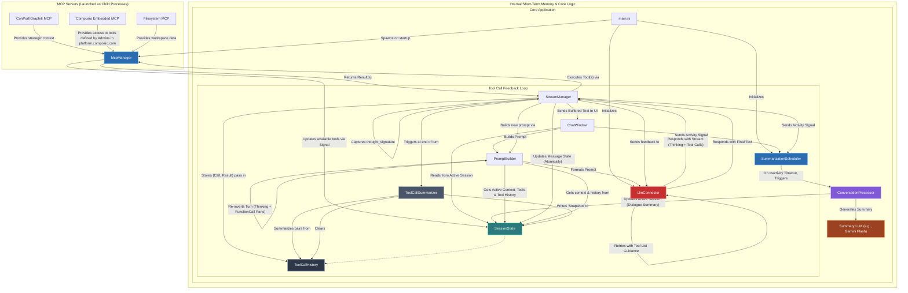
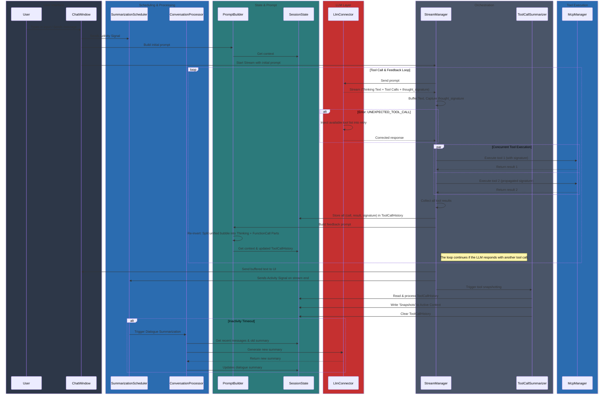

# Hobbes Architecture

This document outlines the software architecture for Hobbes, distinguishing between long-term and short-term memory systems.

## Core Principles

- **Local-First:** All user data, including chat history and context, is stored locally and securely on the user's machine.
- **Clear Memory Separation:** The system maintains a clear distinction between long-term strategic memory (managed by external MCPs like ConPort) and short-term, session-specific active context (managed internally).
- **Reactive State Management:** Internal, short-term context is managed via Dioxus Signals, a reactive state management library. This allows for efficient, declarative updates to the UI and application state without a manual event bus.

## System Components

The architecture is designed to integrate both external long-term memory and internal short-term memory seamlessly.

```mermaid
graph TD
    subgraph "MCP Servers (Launched as Child Processes)"
        A[ConPort/Graphiti MCP] -- "Provides strategic context" --> L;
        B[Composio Embedded MCP] -- "Provides access to tools defined by Admins in platform.composio.com" --> L;
        C[Filesystem MCP] -- "Provides workspace data" --> L;
    end

    subgraph "Internal Short-Term Memory & Core Logic"
        subgraph "Core Application"
            M[main.rs] -->|Spawns on startup| L[McpManager];
            M -->|Initializes| SS[SummarizationScheduler];
            L -->|Updates available tools via Signal| F[SessionState];
            
            G[ChatWindow] -->|Reads from Active Session| F;
            G -->|Sends Activity Signal| SS;

            SS -->|On Inactivity Timeout, Triggers| J[ConversationProcessor];
            J -->|"Updates Active Session (Dialogue Summary)"| F;

            G -->|Builds Prompt| H[PromptBuilder];
            H -->|Gets Active Context, Tools & Tool History| F;
            M -->|Initializes| I[LlmConnector];
            H -->|Formats Prompt| I;

            J -- "Generates Summary" --> I2["Summary LLM (e.g., Gemini Flash)"];

            subgraph "Tool Call Feedback Loop"
                I -- "Responds with Stream (Thinking + Tool Calls)" --> K[StreamManager];
                K -- "Captures thought_signature" --> K;
                K -- "Executes Tool(s) via" --> L;
                L -- "Returns Result(s)" --> K;
                K -- "Sends Buffered Text to UI" --> G;
                K -- "Updates Message State (Atomically)" --> F;
                K -- "Sends Activity Signal" --> SS;
                K -- "Stores (Call, Result) pairs in" --> TCH[ToolCallHistory];
                K -- "Builds new prompt via" --> H;
                H -- "Re-inverts Turn (Thinking + FunctionCall Parts)" --> H;
                H -- "Gets context & history from" --> F;
                K -- "Sends feedback to" --> I;

                I -- "Error: UNEXPECTED_TOOL_CALL" --> I;
                I -- "Retries with Tool List Guidance" --> I;

                I -- "Responds with Final Text" --> K;
                K -- "Triggers at end of turn" --> TCS[ToolCallSummarizer];
                TCS -- "Summarizes pairs from" --> TCH;
                TCS -- "Writes 'Snapshot' to" --> F;
                TCS -- "Clears" --> TCH;
            end
        end
    end

    F -.-> TCH;
    style TCH fill:#2d3748,stroke:#a0aec0,stroke-width:2px,color:#fff
    style TCS fill:#4a5568,stroke:#a0aec0,stroke-width:2px,color:#fff
    style SS fill:#2b6cb0,stroke:#90cdf4,stroke-width:2px,color:#fff
    style J fill:#805ad5,stroke:#d6bcfa,stroke-width:2px,color:#fff
    style F fill:#2c7a7b,stroke:#81e6d9,stroke-width:2px,color:#fff
    style I fill:#c53030,stroke:#fc8181,stroke-width:2px,color:#fff
    style I2 fill:#9c4221,stroke:#fbd38d,stroke-width:2px,color:#fff
    style L fill:#2b6cb0,stroke:#90cdf4,stroke-width:2px,color:#fff
```

### 1. Memory & State

-   **Local Long-Term Memory (MCPS):** I setup a local graphiti server that provides access to the project's strategic memory, including goals, architectural decisions, and user preferences. This is analogous to a project's knowledge base. The user can choose which MCP graph fits thier needs or use the hosted version of graphiti. Called https://www.getzep.com/.
-   **Short-Term Memory (`SessionState`):** The core of the "live" context. This is managed internally and stored securely in `sessions.json`. Each `Session` object within the state contains its own `active_context`, which is a strongly-typed `struct`. It also contains the `tool_call_history`, a short-lived list for in-flight tool interactions.

### 2. Core Services & Processors

-   **`LlmConnector`**: A trait that defines a generic interface for interacting with different LLM providers. The application initializes a concrete implementation (e.g., `GeminiConnector`) based on user settings and provides it to the application context.
-   **`McpManager`**: A central service responsible for managing the lifecycle of all MCP servers. It manages both local child processes (standard MCP) and remote **Composio Integration (custom MCP)**.
    -   **Composio Integration**: Implements an "Explicit Configuration" pattern. Instead of auto-provisioning shared servers, it respects the specific `MCP_CONFIG_ID` embedded in the user's connection URL.
    -   **Auth Flow**: It strictly separates Auth Config creation (POST) from Server Association (PATCH). A crucial step is explicitly patching the MCP server with `auth_config_ids` and `allowed_tools` to enable functionality.
    -   **Tool Loading**: It handles tool enumeration via the MCP Protocol (`tools/list`). It implements smart prefix matching (e.g., matching `NEWS_API_*` to `news_api` toolkit) to correctly associate tools with their parent toolkits, ensuring correct counts even when metadata is sparse.
-   **`StreamManager`**: The central orchestrator for the entire LLM interaction. It implements an **Atomic Execution Model** for tool calls:
    1.  It receives the *entire* raw stream from the `LlmConnector`.
    2.  It buffers all text chunks and collects all tool call requests.
    3.  **Atomic State Sync:** It implements a "Two-Phase Flush" strategy. It updates the UI stream immediately for responsiveness (populating the bubble) but performs a synchronized, atomic update to the main `SessionState` for metadata (thought signatures, summaries) to prevent "disappearing bubbles" during state transitions.
    4.  If tool calls are present, it executes them via the `McpManager` and waits for their completion.
    5.  Only after the tools have finished does it send the buffered text to the UI, ensuring that the AI's conversational response does not appear before the action is complete.
    6.  It is also responsible for managing the feedback loop, sending tool results back to the LLM in a subsequent turn.
    7.  **Dynamic Message Upgrading:** It handles the complex UI state transitions for "Thinking" models. Initially, a message might appear as "Thinking...", then dynamically upgrade to "Calling Tool X...", and finally display the LLM's full response. This involves managing multiple `MessagePart` types within a single UI bubble.
-   **`SummarizationScheduler`**: A background coroutine that automatically triggers **conversation dialogue** summarization. It listens for user activity (e.g., typing, receiving a message) and, after a period of inactivity (e.g., 5 seconds), it invokes the `ConversationProcessor` to update the short-term memory. This ensures the conversational context is always fresh without interrupting the user.
-   **`ConversationProcessor`**: An internal service responsible for generating a stateful, iterative summary of the conversation. It is triggered by the `SummarizationScheduler` and takes the last few messages and the *previous* summary, using a fast LLM (e.g., Gemini Flash) to refine and update the `active_context`.
-   **`ToolCallSummarizer`**: A dedicated service triggered by the `StreamManager` when a conversational turn concludes. It reads the `tool_call_history`, generates a concise "snapshot" for each **tool interaction**, writes these snapshots to the main `active_context` in `SessionState`, and then clears the `tool_call_history`. This is distinct from the dialogue summary.
-   **`PromptBuilder`**: A utility that reads the `active_context` and `tool_call_history` from the current `Session`. It assembles the structured prompt and performs **Type-Safe Schema Conversion** (`mcp_tool_to_gemini`). It relies on reactive synchronization from the `McpManager`'s tool signals to ensure that tool availability is always up-to-date in the active context, enabling immediate tool access after loading.
-   **`SmitheryClient`**: A dedicated client for interacting with the Smithery Registry API. It handles fetching and searching for MCP servers, including authentication and pagination.
-   **`SecretManager`**: A centralized service for managing secure credentials (API keys). It interfaces with the macOS Keychain (via `security-framework`) and implements **Biometric Authentication (Touch ID)**. It uses `LAContext` to manage authentication sessions, reducing password prompts while maintaining high security.

### 3. Robustness & Recovery

Hobbes implements several advanced patterns to ensure stability with "Thinking" models and massive tool contexts:

- **History-Grounded Error Correction:** When the LLM hallucinates a tool name (resulting in `UNEXPECTED_TOOL_CALL`), the `LlmConnector` doesn't just fail. It catches the error, inspects the active `McpManager`, generates a list of *valid* available tools, and re-prompts the model with this grounded context in a "System Note". This turns a crash into a learning moment for the model.
- **Thought Signature Persistence ("The Baton"):** Gemini Thinking models require a cryptographic `thought_signature` to be passed between turns to maintain the reasoning chain. Hobbes treats this as a "Baton" that must be captured from the model's output and strictly returned in the exact history position.
    - **Parallel Call handling:** For parallel tool calls where only the first call receives a signature, Hobbes explicitly **captures** and **propagates** the signature to all subsequent calls in the turn, preventing API Error 400.
- **Turn Re-Inversion:** While the UI unifies "Thinking" and "Tool Use" into a single bubble for user clarity (see Dynamic Message Upgrading), the `PromptBuilder` intelligently "re-inverts" this into separate protocol parts (Thinking Part + Function Call Part) when communicating with the API, satisfying strict structural requirements.

### 4. Native UI Components

-   **Native Menu (`menu.rs`):** To ensure standard hotkeys (e.g., Copy, Paste, Quit) work as expected, the application initializes a native OS menu bar at startup. This is built using the `muda` crate and configured in `main.rs`.
-   **System Tray Icon (`tray.rs`):** The application features a system tray icon that allows the user to toggle the main window's visibility. The icon's presence is reactive and can be enabled or disabled in real-time from the settings panel.
-   **Chat Bar Icons:** The chat interface features a modular icon bar with visibility toggles managed in Settings.
    -   **Context & History:** Toggles for the Chat History sidebar.
    -   **Tools & Attachments:** Toggles for MCP Tools, Attachments, and Profile selection.
    -   **Behavior:** Icons update reactively based on usage (e.g., highlighting when tools are active).
-   **Dynamic App Icons:** The application correctly bundles macOS `.icns` files and handles Dioxus 0.6 bundle metadata requirements to ensure the correct app icon appears in the Dock and About screens.

### 5. Multimodal Input Flow

-   **`ChatInput` Component:** This component is enhanced with drag-and-drop event handlers (`ondragover`, `ondragleave`, `ondrop`) and a file picker button. It manages a list of pending attachments, displaying previews and allowing users to remove them before sending.
-   **`Attachment` Data Structure:** A new `Attachment` struct in `packages/hobbes_core/src/models.rs` supports extensible file attachments. It contains `file_name`, `mime_type`, and `data` (a base64 data URI). The `Message` struct is modified to include a `Vec<Attachment>`.
-   **`PromptBuilder` Refactor:** The `PromptBuilder` is updated to iterate over the `attachments` vector in each message. For each attachment, it creates a `Part` with `inlineData` containing the base64 string and the correct `mime_type`, correctly formatting the request for the Gemini API.
-   **`MessageList` Rendering:** The message rendering logic in `MessageList` is updated to iterate over the `attachments` vector. It renders an `` tag for image MIME types and a placeholder for other file types.

## Interaction Flow (UML Sequence)

This sequence diagram illustrates the detailed interaction between components for the new tool context flow.

```mermaid
sequenceDiagram
    box rgb(45, 55, 72) User Interface
        participant User
        participant ChatWindow
    end
    box rgb(43, 108, 176) Scheduling & Processing
        participant SummarizationScheduler
        participant ConversationProcessor
    end
    box rgb(44, 122, 123) State & Prompt
        participant PromptBuilder
        participant SessionState
    end
    box rgb(197, 48, 48) LLM Layer
        participant LlmConnector
    end
    box rgb(74, 85, 104) Orchestration
        participant StreamManager
        participant ToolCallSummarizer
    end
    box rgb(43, 108, 176) Tool Execution
        participant McpManager
    end

    User->>ChatWindow: Types in input / Sends message
    ChatWindow->>SummarizationScheduler: Sends Activity Signal
    
    ChatWindow->>PromptBuilder: Build initial prompt
    PromptBuilder->>SessionState: Get context
    ChatWindow->>StreamManager: Start Stream with initial prompt

    loop Tool Call & Feedback Loop
        StreamManager->>LlmConnector: Send prompt
        LlmConnector-->>StreamManager: Stream (Thinking Text + Tool Calls + thought_signature)
        StreamManager->>StreamManager: Buffer Text, Capture thought_signature
        
        alt Error: UNEXPECTED_TOOL_CALL
            LlmConnector->>LlmConnector: Inject available tool list into retry
            LlmConnector-->>StreamManager: Corrected response
        end
        
        par Concurrent Tool Execution
            StreamManager->>McpManager: Execute tool 1 (with signature)
            McpManager-->>StreamManager: Return result 1
        and
            StreamManager->>McpManager: Execute tool 2 (propagated signature)
            McpManager-->>StreamManager: Return result 2
        end
        
        StreamManager->>StreamManager: Collect all tool results
        StreamManager->>SessionState: Store all (call, result, signature) in ToolCallHistory
        
        StreamManager->>PromptBuilder: Build feedback prompt
        PromptBuilder->>PromptBuilder: Re-invert: Split unified bubble into Thinking + FunctionCall Parts
        PromptBuilder->>SessionState: Get context & updated ToolCallHistory
        
        note right of StreamManager: The loop continues if the LLM responds with another tool call.
    end

    StreamManager->>ChatWindow: Send buffered text to UI
    StreamManager->>SummarizationScheduler: Sends Activity Signal on stream end
    
    StreamManager->>ToolCallSummarizer: Trigger tool snapshotting
    ToolCallSummarizer->>SessionState: Read & process ToolCallHistory
    ToolCallSummarizer->>SessionState: Write 'Snapshots' to Active Context
    ToolCallSummarizer->>SessionState: Clear ToolCallHistory

    alt Inactivity Timeout
        SummarizationScheduler->>ConversationProcessor: Trigger Dialogue Summarization
        ConversationProcessor->>SessionState: Get recent messages & old summary
        ConversationProcessor->>LlmConnector: Generate new summary
        LlmConnector-->>ConversationProcessor: Return new summary
        ConversationProcessor->>SessionState: Updates dialogue summary
    end
```

## External References

- [Composio MCP Documentation](https://docs.composio.dev/docs/welcome)
- [Composio MCP Server Dynamic Creation API](https://docs.composio.dev/rest-api/mcp/get-mcp-servers)
- **Composio Connection Endpoint Pattern:** `https://backend.composio.dev/v3/mcp/SERVERID/mcp?user_id=IDFROMHOBBESNOTCOMPOSIO`