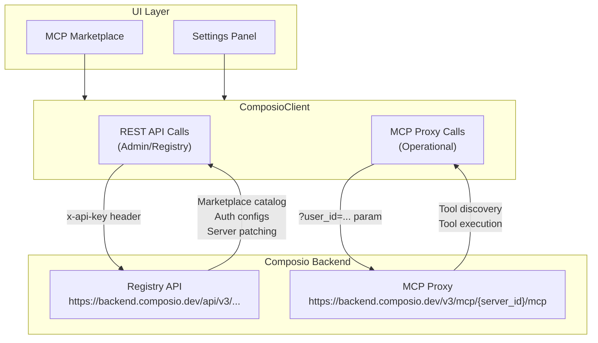

# Composio API Endpoints Reference

This document catalogs all Composio API calls made by the `ComposioClient` in Hobbes, organized by API surface (REST vs MCP) and their purpose.

## Architecture Overview



---

## API Surface Summary

Composio exposes three distinct API surfaces. It is critical to distinguish between the **Configuration Endpoint** (REST) and the **Operational Endpoint** (Proxy).

### 1. REST Registry (`/api/v3/...`)
Used for global account management tasks such as creating auth configurations, listing connected accounts, and browsing the marketplace catalog.
*   **Auth**: `x-api-key` header

### 2. MCP Configuration Endpoint (`/api/v3/mcp/{server_id}`)
**"The First MCP Endpoint"**
Used **strictly for configuration** of the MCP server instance itself. You PATCH this endpoint to register toolkits, bind auth configurations, and set allowed tools.
*   **Protocol**: REST
*   **Auth**: `x-api-key` header
*   **Payload**: Object with `toolkits`, `auth_config_ids`, `allowed_tools`

### 3. MCP Operational Proxy (`/v3/mcp/{server_id}/mcp`)
**"The Second MCP Endpoint"**
Used **strictly for operation** (runtime usage). This is the endpoint that the LLM/Agent talks to via the MCP protocol. It proxies JSON-RPC requests to the underlying tools.
*   **Protocol**: JSON-RPC over HTTP (SSE)
*   **Auth**: `user_id` query parameter (No API Key)
*   **Payload**: JSON-RPC body

> [!WARNING]
> **The Redirect Trap**: The route `/v3/mcp/{server_id}` (without the `/mcp` suffix) exists but returns a **307 Redirect to SSE**. It is NOT a REST endpoint for configuration. Always use the `/api/v3/mcp/{server_id}` endpoint for configuration (PATCH).

---

## REST API Calls (Registry/Admin)

These calls use the `x-api-key` header for authentication and are used for administrative/setup tasks.

| Function | HTTP | Endpoint | Purpose |
|----------|------|----------|---------|
| `validate_composio_api_key()` | GET | `/api/v1/cli/auth/user_info` | Validate API key on profile setup |
| `list_connected_accounts()` | GET | `/api/v3/connected_accounts?user_id=&user_uuid=` | Cache hydration for account IDs (used by `execute_tool`) |
| `create_auth_config()` | POST | `/api/v3/auth_configs` | Create OAuth/API key auth configuration for a toolkit |
| `get_auth_config_id()` | GET | `/api/v3/auth_configs?toolkitSlug=` | Retrieve existing auth config ID |
| `list_all_toolkits()` | GET | `/api/v3/toolkits?...` | Fetch marketplace catalog (paginated) |
| `list_toolkit_categories()` | GET | `/api/v3/toolkits/categories` | Fetch category list for marketplace filtering |
| `get_toolkit_tools()` | GET | `/api/v3/tools/enum` | Get tool names for a specific toolkit |
| `get_toolkit_tools_detailed()` | GET | `/api/v3/tools/enum` | Get tool names + descriptions for smart selection |
| `create_mcp_server()` | POST | `/api/v3/mcp/servers/custom` | Create new MCP server. **Payload**: `toolkits` (string[]), `auth_config_ids` (string[]) |
| `create_mcp_instance()` | POST | `/api/v3/mcp/servers/{id}/instances` | Bind user to server (required for tools visibility) |
| `add_toolkit_to_server()` | PATCH | `/api/v3/mcp/{server_id}` | Add toolkit + auth_config binding to MCP server |
| `list_mcp_servers()` | GET | `/api/v3/mcp/servers` | List available servers (Dynamic Lookup) |
| `generate_mcp_user()` | POST | `/api/v3/mcp/servers/generate` | Bind user_id to server (Mandatory User Generation) |
| `initiate_connection()` | POST | `/api/v3/connected_accounts/link` | Generate OAuth link URL for user authentication |

---

## MCP Proxy Calls (Operational)

These calls use the `user_id` query parameter for routing and **do not** include `x-api-key`. They follow JSON-RPC 2.0 protocol.

| Function | Method | JSON-RPC Method | Purpose |
|----------|--------|-----------------|---------|
| `list_tools()` | POST | `tools/list` | Get all tools available for the user's connected toolkits |
| `get_connected_toolkit_slugs()` | POST | `tools/list` | Derive connected toolkit slugs from tool names |
| `list_connected_toolkits()` | POST | `tools/list` | Group tools by toolkit for UI display |
| `list_tools_filtered()` | POST | `tools/list` | Get tools filtered by toolkit slug |
| `search_tools()` | POST | `tools/list` | Search tools by query string |
| `list_tools_for_session()` | POST | `tools/list` | Get tools for force-loaded toolkits in a chat session |
| `execute_tool()` | POST | `tools/call` | Execute a tool with arguments |

---

## URL Construction

### REST API Base URL
Derived from the MCP endpoint URL stored in the profile:
```
Input:  https://backend.composio.dev/v3/mcp/0a4474b3-d8e6-4417-a848-0d0c867b20f4/mcp
Output: https://backend.composio.dev/api/v3
```

### MCP Proxy URL
Built using the stored base URL with `user_id` appended:
```
Base:   https://backend.composio.dev/v3/mcp/0a4474b3-d8e6-4417-a848-0d0c867b20f4/mcp
Output: https://backend.composio.dev/v3/mcp/0a4474b3-d8e6-4417-a848-0d0c867b20f4/mcp?user_id=bb98696d-d833-4953-8857-091cb87cc041
```

---

## Critical Mandates

1. **MCP-First for Status**: Connected toolkit status in the Marketplace MUST be derived from `tools/list` MCP response, NOT from `list_connected_accounts` REST call.

2. **Pure MCP Payload**: Do NOT inject `user_id` or `connected_account_id` into the JSON-RPC body. These are routing parameters, not payload data.

3. **No API Key on Proxy**: MCP Proxy calls MUST NOT include the `x-api-key` header. Auth is implicit via `user_id`.

4. **Accept Header**: MCP Proxy calls MUST include `Accept: application/json, text/event-stream` header for SSE responses.

5. **Payload Format Mandate** (Unified Jan 2026): Both `PATCH /api/v3/mcp/{server_id}` and `POST /api/v3/mcp/servers/custom` MUST use **String Arrays**:
   - `toolkits`: Array of Strings (slags) e.g., `["gmail", "slack"]`
   - `auth_config_ids`: Array of Strings (IDs) e.g., `["ac_123", "ac_456"]`
   - **FORBIDDEN**: Do NOT use Object-based binding (`[{ "toolkit": "slug", "auth_config": "id" }]`). This fails validation.

6. **Mandatory User Generation** (Pattern 110): After patching a server, you MUST call `POST /api/v3/mcp/servers/generate` to bind the `user_id` to that server instance. Without this, tools will not be visible to the LLM.
