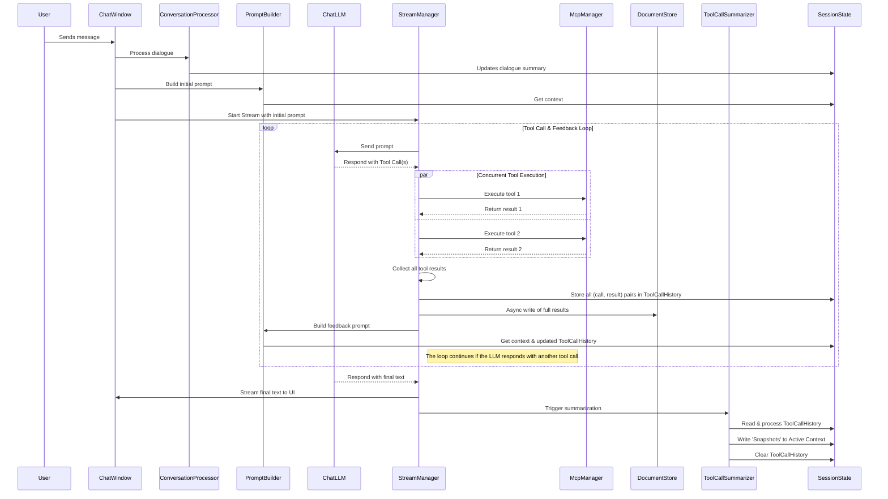

# Proposed Architecture: Enhanced Tool Context

This document outlines a revised architecture for Hobbes to address a core issue: the LLM losing context during sequential tool calls, leading to conversational loops. The current system sends the *result* of a tool call back to the LLM but omits the context of the *original tool call itself*.

The proposed solution introduces a more robust system for managing tool call history, separating long-term storage from immediate, in-flight context.

## Core Goals
1.  **Eliminate Context Loops:** Provide the LLM with a clear history of its own actions (`tool_call` + `tool_result`) within a single conversational turn.
2.  **Long-Term Knowledge:** Store detailed tool call results in a searchable long-term vector store for future reference and RAG.
3.  **Efficient Prompting:** Keep the immediate prompt context concise by summarizing tool interactions after a conversational turn is complete.

## Proposed Architecture Diagram (High-Level Flow)

This diagram illustrates the new components and data flows, building upon the existing architecture.

```mermaid
graph TD
    subgraph "MCP Servers (Launched as Child Processes)"
        A[ConPort MCP] -- "Provides strategic context" --> L;
        B[GitHub MCP] -- "Provides PR/Issue data" --> L;
        C[Filesystem MCP] -- "Provides workspace data" --> L;
    end

    subgraph "Long-Term Vector Storage"
        V[DocumentStore]
        style V fill:#008080,stroke:#333,stroke-width:2px
    end

    subgraph "Internal Short-Term Memory & Core Logic"
        subgraph "Core Application"
            M[main.rs] -->|Spawns on startup| L[McpManager];
            L -->|Updates available tools via Signal| F[SessionState];
            
            G[ChatWindow] -->|Reads from Active Session| F;
            G -->|Triggers| J[ConversationProcessor];
            J -->|"Updates Active Session (Dialogue Summary)"| F;

            G -->|Builds Prompt| H[PromptBuilder];
            H -->|Gets Active Context, Tools & Tool History| F;
            H -->|Formats Prompt| I["Chat LLM (e.g., Gemini Pro)"];
            G -- "Sends Message" --> I;

            J -- "Generates Summary" --> I2["Summary LLM (e.g., Gemini Flash)"];

            subgraph "NEW Tool Call Feedback Loop"
                I -- "Responds with Tool Call" --> K[StreamManager];
                K -- "Updates Message State" --> F;
                K -- "Executes Tool(s) via" --> L;
                L -- "Returns Result(s)" --> K;
                K -- "Collects all results" --> K;
                K -- "Stores (Call, Result) pairs in" --> TCH[ToolCallHistory];
                K -- "Async write of full results to" --> V;
                K -- "Builds new prompt via" --> H;
                H -- "Gets context & history from" --> F;
                K -- "Sends feedback to" --> I;

                I -- "Responds with Final Text" --> K;
                K -- "Triggers" --> TCS[ToolCallSummarizer];
                TCS -- "Summarizes pairs from" --> TCH;
                TCS -- "Writes 'Snapshot' to" --> F;
                TCS -- "Clears" --> TCH;
            end
        end
    end

    F -.-> TCH;
    style TCH fill:#ffb703,stroke:#333,stroke-width:2px
    style TCS fill:#fb8500,stroke:#333,stroke-width:2px
    style J fill:#c77dff,stroke:#333,stroke-width:2px
    style F fill:#f4a261,stroke:#333,stroke-width:2px
    style I fill:#e76f51,stroke:#333,stroke-width:2px
    style I2 fill:#f77f00,stroke:#333,stroke-width:2px
    style L fill:#457b9d,stroke:#333,stroke-width:2px
```



## UML Sequence Diagram (Interaction Flow)

This UML sequence diagram illustrates the detailed interaction between components for the new tool context flow.



## New & Modified Components

### 1. ToolCallHistory (`SessionState` addition)
-   **Description:** A new, short-lived list within the `SessionState` struct. Its sole purpose is to hold the complete `(tool_call, tool_result)` pairs for the *current* chain of tool interactions.
-   **Lifecycle:** It is populated as tools are executed and is cleared by the `ToolCallSummarizer` once the LLM provides a final text response, ending the tool-use loop.
-   **Struct Example:**
    ```rust
    struct ToolCallRecord {
        call: ToolCall,
        result: ToolResult,
    }

    // In SessionState:
    tool_call_history: Vec<ToolCallRecord>,
    ```

### 2. DocumentStore (Vector DB)
-   **Description:** A long-term, asynchronous storage solution (e.g., using Qdrant). It ingests and indexes the full, verbose content from tool call responses and user-uploaded documents.
-   **Dual Purpose:**
    1.  **RAG:** Allows the LLM to perform semantic searches to find relevant documents or past tool results to inform its reasoning.
    2.  **Full Context Loading:** Provides a mechanism to retrieve the complete, original content of a document or tool result when a RAG snippet is insufficient. The reference to this full content can be stored in the summary snapshot.

### 3. ToolCallSummarizer (New Service)
-   **Description:** A new, dedicated service that is triggered when a tool-calling sequence concludes (i.e., when the LLM responds with text).
-   **Justification (Optimal Separation of Concerns):** Creating a new service adheres to the principle we logged in ConPort (ID: 19). The existing `ConversationProcessor` is focused on summarizing *dialogue*. This new service will focus exclusively on summarizing *tool interactions*, keeping each component's responsibility clear and maintainable.
-   **Function:** It reads the `ToolCallHistory`, generates a concise "snapshot" for each entry, writes these snapshots to the main `active_context` map in `SessionState`, and then clears the `ToolCallHistory`.
-   **Snapshot Structure:**
    ```json
    {
      "tool_name": "brave_web_search",
      "arguments": { "query": "Dioxus state management" },
      "result_summary": "Found official documentation and several tutorials on using Signals for state management.",
      "full_result_ref": "qdrant_vector_id:1234-5678"
    }
    ```

### 4. PromptBuilder (Modified)
-   **Description:** The `PromptBuilder` will be updated to assemble a more comprehensive context.
-   **New Logic:** Before sending a prompt to the LLM, it will:
    1.  Read the standard `active_context` (containing dialogue summaries and past tool snapshots).
    2.  Read the `ToolCallHistory` list.
    3.  Append the full `(tool_call, tool_result)` pairs from the history to the prompt. This gives the LLM immediate, perfect recall of its actions *within the current turn*.

## Revised Data Flow: The Inner Loop

This sequence details how the system will handle a tool call from start to finish.

1.  **Tool Call:** The Chat LLM responds with a request to call a tool.
2.  **Execution:** The `StreamManager` detects the request, updates the UI, and executes the tool via the `McpManager`.
3.  **History Capture:** Upon receiving the result, the `StreamManager` packages the original `ToolCall` and the `ToolResult` into a `ToolCallRecord` and pushes it into the `SessionState`'s `tool_call_history` list.
4.  **Long-Term Storage:** The `StreamManager` spawns an asynchronous task to send the full, verbose `ToolResult` to the `DocumentStore` for indexing.
5.  **Re-Prompting:** The `PromptBuilder` is invoked. It sees the new record in `tool_call_history` and includes its full content in the next prompt sent back to the Chat LLM.
6.  **Loop or Conclude:**
    -   If the LLM responds with *another* tool call, steps 1-5 repeat.
    -   If the LLM responds with a *text message*, the inner loop is considered complete.
7.  **Summarization:** The `ToolCallSummarizer` is triggered. It iterates through the records in `tool_call_history`, generates a concise snapshot for each, and appends these snapshots to the main `active_context`.
8.  **Cleanup:** After summarization, the `ToolCallSummarizer` clears the `tool_call_history` list, completing the cycle.

---

## Code Review Findings & Justification

A review of the relevant codebase confirms that the initial implementation attempt was flawed, leading to a hard rollback. The architecture has now been successfully refactored according to the following principles:

1.  **`ConversationProcessor` is for Dialogue Only:** The review of `src/processing/conversation_processor.rs` shows its sole responsibility is summarizing user/AI dialogue. The new **`ToolCallSummarizer`** correctly separates the concern of summarizing tool interactions.

2.  **`StreamManager` is the Central Orchestrator:** The refactored `src/components/stream_manager.rs` is now the single point of control for the entire tool-call lifecycle. It uses a robust, channel-based mechanism to await concurrent tool executions, preventing deadlocks. It is also now solely responsible for managing the LLM feedback loop, removing this complex logic from the UI layer.

3.  **`PromptBuilder` is a Pure Function:** The review of `src/context/prompt_builder.rs` confirms its role has been simplified. It no longer needs to append the `tool_call_history`, as this is now handled by the `StreamManager`'s centralized logic. It acts as a pure builder, assembling context without managing stateful loops.

This plan provides a clear and logical path to implement the required changes within the existing structure of the application.