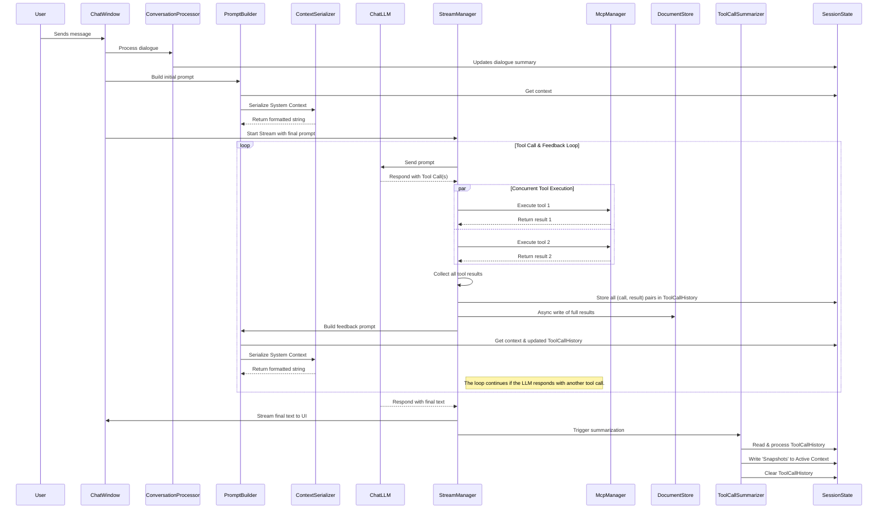

# Proposed Improvement (2025-09-21): Smart Context Serialization

This document proposes a refactor of the `PromptBuilder` to improve how system context is managed and sent to the LLM. This is an evolution of the architecture described in `ARCHITECTURE.md`.

## 1. Problem Statement

The current implementation of the `PromptBuilder` serializes the *entire* `ActiveContext` struct into a single, large JSON string. This is sent as the `system_instruction` to the LLM.

**Weaknesses:**
-   **Lack of Prioritization:** All context is treated equally. Critical information (like a failed tool call) has the same weight as less important metadata.
-   **High Token Consumption:** As the `ActiveContext` grows, the JSON blob becomes very large, consuming a significant portion of the LLM's context window.
-   **Poor Readability for LLM:** A dense, single-line JSON string is less effective for the LLM to parse and understand compared to a well-formatted, structured text block.

## 2. Proposed Solution: The "Smart Serializer"

We will introduce a new logical component, the **`ContextSerializer`**, which will be responsible for intelligently building the `system_instruction` string.

**Responsibilities:**
-   **Selection & Prioritization:** It will selectively pull the most relevant pieces of information from the `ActiveContext` based on a predefined order of importance.
-   **Formatting:** It will format this selected information into a more readable, structured string for the LLM.
-   **Budgeting:** It will operate within a token budget, ensuring we always include the highest-priority context without exceeding prompt size limits.

This moves us from providing raw data to providing curated, prioritized context.

## 3. Updated System Architecture

The following diagram shows the introduction of the `ContextSerializer` which is logically part of the `PromptBuilder`.

```mermaid
graph TD
    subgraph "MCP Servers (Launched as Child Processes)"
        A[ConPort MCP] -- "Provides strategic context" --> L;
        B[GitHub MCP] -- "Provides PR/Issue data" --> L;
        C[Filesystem MCP] -- "Provides workspace data" --> L;
    end

    subgraph "Long-Term Vector Storage"
        V[DocumentStore]
        style V fill:#008080,stroke:#333,stroke-width:2px
    end

    subgraph "Internal Short-Term Memory & Core Logic"
        subgraph "Core Application"
            M[main.rs] -->|Spawns on startup| L[McpManager];
            L -->|Updates available tools via Signal| F[SessionState];
            
            G[ChatWindow] -->|Reads from Active Session| F;
            G -->|Triggers| J[ConversationProcessor];
            J -->|"Updates Active Session (Dialogue Summary)"| F;

            G -->|Builds Prompt| H[PromptBuilder];
            H -->|Gets Active Context, Tools & Tool History| F;
            
            subgraph "Smart Serialization Logic"
                H -->|Passes ActiveContext to| CS[ContextSerializer];
                CS -->|Returns formatted string| H;
            end

            H -->|Formats Prompt| I["Chat LLM (e.g., Gemini Pro)"];
            G -- "Sends Message" --> I;

            J -- "Generates Summary" --> I2["Summary LLM (e.g., Gemini Flash)"];

            subgraph "NEW Tool Call Feedback Loop"
                I -- "Responds with Tool Call" --> K[StreamManager];
                K -- "Updates Message State" --> F;
                K -- "Executes Tool(s) via" --> L;
                L -- "Returns Result(s)" --> K;
                K -- "Collects all results" --> K;
                K -- "Stores (Call, Result) pairs in" --> TCH[ToolCallHistory];
                K -- "Async write of full results to" --> V;
                K -- "Builds new prompt via" --> H;
                H -- "Gets context & history from" --> F;
                K -- "Sends feedback to" --> I;

                I -- "Responds with Final Text" --> K;
                K -- "Triggers" --> TCS[ToolCallSummarizer];
                TCS -- "Summarizes pairs from" --> TCH;
                TCS -- "Writes 'Snapshot' to" --> F;
                TCS -- "Clears" --> TCH;
            end
        end
    end

    F -.-> TCH;
    style CS fill:#e9c46a,stroke:#333,stroke-width:2px
    style TCH fill:#ffb703,stroke:#333,stroke-width:2px
    style TCS fill:#fb8500,stroke:#333,stroke-width:2px
    style J fill:#c77dff,stroke:#333,stroke-width:2px
    style F fill:#f4a261,stroke:#333,stroke-width:2px
    style I fill:#e76f51,stroke:#333,stroke-width:2px
    style I2 fill:#f77f00,stroke:#333,stroke-width:2px
    style L fill:#457b9d,stroke:#333,stroke-width:2px
```



### 4. Updated Component Descriptions

-   **`PromptBuilder`**: A utility that reads the `active_context` and `tool_call_history` from the current `Session`. It assembles the conversation history and available MCP tools. **Crucially, it now delegates the creation of the `system_instruction` to the `ContextSerializer` to ensure the context is prioritized and formatted effectively.** It then assembles the final structured prompt object to be sent to the LLM service.
-   **`ContextSerializer` (New Logic within PromptBuilder):** This is the "smart" component responsible for transforming the raw `ActiveContext` struct into a concise, prioritized, and formatted string for the `system_instruction`. It operates on a budget to ensure the most critical information is included without exceeding token limits.

### 5. Updated Interaction Flow

The sequence diagram is updated to show the new serialization step.



### 6. Implementation Details: The "Smart Serializer" Logic

To achieve our goal, the `ContextSerializer` will follow a specific logic for prioritization, formatting, and budgeting.

#### 6.1. Context Priority Order

The serializer will build the system instruction string by appending fields from the `ActiveContext` in a specific order of importance. If the token budget is reached, it will stop, ensuring the most critical information is always included.

1.  **CRITICAL (Always Included):**
    *   **Tool Recovery Instructions:** If a previous tool call failed, this is the most important piece of context.
    *   **Explicit User Instructions:** Any direct commands or clarifications for the AI (e.g., the "ask for user's name" instruction).

2.  **HIGH PRIORITY (Core Directives):**
    *   **System Persona:** The fundamental identity and instructions for the AI.
    *   **Current Focus:** The immediate goal of the conversation, as defined in the active context.
    *   **Recent Changes:** A summary of what has just happened to orient the AI.

3.  **MEDIUM PRIORITY (Session Context):**
    *   **Conversation Summary:** The LLM-generated summary of the dialogue so far. This provides the main conversational context.

4.  **LOW PRIORITY (Supporting Details):**
    *   **Key Entities:** Important names, places, or topics extracted from the conversation.
    *   **Current Time & Date:** To ground the AI in the present.

#### 6.2. Proposed Formatting

Instead of a dense JSON blob, the output will be a clean, human-readable (and LLM-readable) string using markdown-style headers.

**Example Output:**

```
### CRITICAL INSTRUCTIONS
- A previous tool call failed. Analyze the error and try a different approach.

### CORE DIRECTIVES
- Persona: You are Hobbes, an AI assistant...
- Current Focus: Refactor the PromptBuilder for context prioritization.

### SESSION CONTEXT
- Summary of Conversation: The user and AI have agreed on a plan to implement a 'smart serializer' for the system prompt.
- Key Entities:
  - User Name: Dustin
- Current Time: 2025-09-21T18:18:46Z (UTC)
```

#### 6.3. Dynamic Token Budgeting

To make the system flexible and future-proof, the token budget for the system prompt will be dynamic and user-configurable.

-   **Model-Aware Budgeting:** The total token budget will be calculated as a percentage of the selected chat model's maximum context window. For example, if the user selects a model with a 128k context window and sets the budget to 10%, the `ContextSerializer` will aim for a system prompt of approximately 12,800 tokens.
-   **Configuration:** We will store a simple map of known model names to their context window sizes.
-   **User Interface:** The setting will be exposed in the settings panel as a percentage slider (e.g., 5% to 50%), providing an intuitive way for the user to balance context richness with performance.

This approach automatically adapts to different models and gives the user fine-grained control over the context strategy.