# Hobbes

Hobbes is an AI agent designed to assist the user, Dustin. It features a clear separation between long-term strategic memory (ConPort) and short-term conversational context.

## Key Features

- **Local-First:** All user data, including chat history and context, is stored locally and securely on the user's machine.
- **Clear Memory Separation:** The system maintains a clear distinction between long-term strategic memory (managed by external MCPs like ConPort) and short-term, session-specific active context (managed internally).
- **Reactive State Management:** Internal, short-term context is managed via Dioxus Signals, a reactive state management library. This allows for efficient, declarative updates to the UI and application state.

## Getting Started

This project is built with Dioxus and Rust.

### Prerequisites
- Rust toolchain
- Dioxus CLI (`dx`)

### Serving Your App

Run the following command in the root of your project to start developing:

```bash
dx serve --platform desktop
```

## Architecture

The architecture is designed to integrate both external long-term memory and internal short-term memory seamlessly, with feedback loop for handling tool calls.



```mermaid
graph TD
    subgraph "MCP Servers (Launched as Child Processes)"
        A[ConPort MCP] -- "Provides strategic context" --> L;
        B[GitHub MCP] -- "Provides PR/Issue data" --> L;
        C[Filesystem MCP] -- "Provides workspace data" --> L;
    end

    subgraph "Long-Term Vector Storage"
        V[DocumentStore]
        style V fill:#008080,stroke:#333,stroke-width:2px
    end

    subgraph "Internal Short-Term Memory & Core Logic"
        subgraph "Core Application"
            M[main.rs] -->|Spawns on startup| L[McpManager];
            L -->|Updates available tools via Signal| F[SessionState];
            
            G[ChatWindow] -->|Reads from Active Session| F;
            G -->|Triggers| J[ConversationProcessor];
            J -->|"Updates Active Session (Dialogue Summary)"| F;

            G -->|Builds Prompt| H[PromptBuilder];
            H -->|Gets Active Context, Tools & Tool History| F;
            H -->|Formats Prompt| I["Chat LLM (e.g., Gemini Pro)"];
            G -- "Sends Message" --> I;

            J -- "Generates Summary" --> I2["Summary LLM (e.g., Gemini Flash)"];

            subgraph "NEW Tool Call Feedback Loop"
                I -- "Responds with Tool Call" --> K[StreamManager];
                K -- "Updates Message State" --> F;
                K -- "Executes Tool(s) via" --> L;
                L -- "Returns Result(s)" --> K;
                K -- "Collects all results" --> K;
                K -- "Stores (Call, Result) pairs in" --> TCH[ToolCallHistory];
                K -- "Async write of full results to" --> V;
                K -- "Builds new prompt via" --> H;
                H -- "Gets context & history from" --> F;
                K -- "Sends feedback to" --> I;

                I -- "Responds with Final Text" --> K;
                K -- "Triggers" --> TCS[ToolCallSummarizer];
                TCS -- "Summarizes pairs from" --> TCH;
                TCS -- "Writes 'Snapshot' to" --> F;
                TCS -- "Clears" --> TCH;
            end
        end
    end

    F -.-> TCH;
    style TCH fill:#ffb703,stroke:#333,stroke-width:2px
    style TCS fill:#fb8500,stroke:#333,stroke-width:2px
    style J fill:#c77dff,stroke:#333,stroke-width:2px
    style F fill:#f4a261,stroke:#333,stroke-width:2px
    style I fill:#e76f51,stroke:#333,stroke-width:2px
    style I2 fill:#f77f00,stroke:#333,stroke-width:2px
    style L fill:#457b9d,stroke:#333,stroke-width:2px
```

### Core Components

-   **Memory Systems**:
    -   **Local Long-Term Memory (ConPort):** A local MCP that provides access to the project's strategic memory, including goals, architectural decisions, and user preferences.
    -   **Short-Term Memory (`SessionState`):** The core of the "live" context, managed internally and stored securely in `sessions.json`. It holds messages, tool call history, and the active context for each conversation.
-   **Context Producers & Processors**:
    -   **`McpManager`**: Manages the lifecycle of all MCP servers, launching them as child processes and discovering their available tools.
    -   **`ConversationProcessor`**: Summarizes dialogue using a dedicated Summary LLM to maintain conversational memory.
-   **Tool Call Handling**:
    -   **`StreamManager`**: Orchestrates the entire tool-call lifecycle, from detecting the LLM's request to executing the tool and feeding the result back.
    -   **`ToolCallHistory`**: A short-lived list in `SessionState` that holds the `(tool_call, tool_result)` pairs for the current chain of interactions.
    -   **`ToolCallSummarizer`**: A dedicated service that creates concise "snapshots" of tool interactions for the active context after a tool loop concludes.
    -   **`DocumentStore`**: A long-term vector store (e.g., Qdrant) for indexing verbose tool results and documents for future Retrieval Augmented Generation (RAG).

## Contributing

Please see [`CONTRIBUTING.md`](CONTRIBUTING.md) for details on how to contribute to the project.
