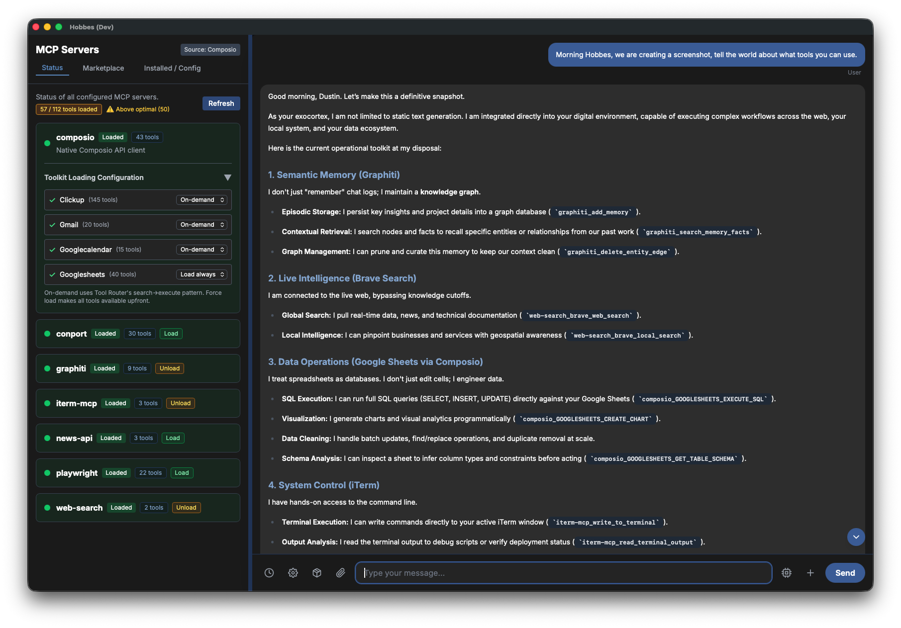
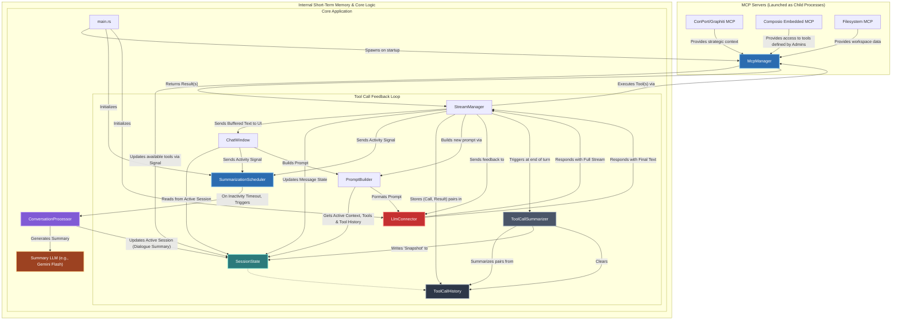

# Hobbes


[](https://rust-reportcard.xzu.fi/report/github.com/dustmoo/cai-hobbes)


## Welcome to Hobbes!

I started playing around with Google Gemini Pro 2.5 last year and was amazed at how _smart_ it was. Being a long-time Claude user, I missed the "personability" of the model, even though 2.5 was a fantastic writer, coder, and assistant (approaching Sonnet performance for a fraction of the price 😅). So, as part of my 2025 journey, I decided to use [Dioxus 0.6.3](https://dioxuslabs.com/) to create my very own useful assistant.

### What is Hobbes?

-   **Private & Local-First:** Hobbes is a FOSS chatbot built in **Rust** and **Tailwind**, designed to be **more private** than standard web interfaces. Conversations are stored securely on your Mac, and it uses Google's Generative API to access models directly.
-   **Context Composition Experiment:** Tired of hitting "New Chat" when the AI gets confused by too much context? Hobbes combines a set limit for past conversation (defaults to 75 messages) with a **Summary Model** that maintains an up-to-date "Memory Object". This passive summarization keeps the AI on track, allowing you to chat all day in a single session.
-   **Educational Project:** I built Hobbes to dust off my dev hat and learn Rust (loving it!). While I haven't used Dioxus to its absolute theoretical limit, the app is functional and fast. It is currently highly optimized for **macOS**, but Windows and Linux are on the roadmap. (Have ideas? [Contribute!](CONTRIBUTING.md))
-   **For AI Enthusiasts:** Hobbes integrates local **MCP (Model Context Protocol)** execution and features integration with [**Composio**](https://composio.dev/) (via OAuth) for extended capabilities.
    > **Note:** The Composio integration is currently tightly coupled to Hobbes and is custom-built.



**Note:** Hobbes needs some setup. You will need to obtain your own API keys. If you prefer a zero-setup experience, web-based options might be better for now.

---

## Hobbes Features

- **Local-First:** All user data, including chat history and context, is stored locally and securely on the user's machine.
- **Clear Memory Separation:** The system maintains a clear distinction between long-term strategic memory and short-term, session-specific active context.
    - **Strategic Memory:** Hobbes creates a local semantic graph. I personally use [ConPort (Context Portal)](https://github.com/GreatScottyMac/context-portal) from the Roo Code community for task-specific memory, combined with [Zep's Graphiti](https://github.com/getzep/graphiti) for long-term knowledge graphs.
- **Native Composio Integration:** Features a custom, native integration with [Composio](https://composio.dev/), allowing for OAuth-based connection to hundreds of external tools (GitHub, Slack, Maps, etc.) without exposing your keys to a third-party wrapper.
    -   **Smart Composio Tool Selection:** Managing MCP toolkits can be overwhelming—the GitHub MCP alone has over 700 tools, and knowing where to start is a challenge. Hobbes solves this by using AI to automatically select the most relevant core tools (top ~25) to get you started immediately without the headache. You can always customize your toolset further at [platform.composio.dev](https://platform.composio.dev).
    - *See the in-app onboarding for setup instructions.*
- **Advanced Reasoning Engine:** Built-in support for Gemini 2.5/3.0 "Thinking" models, with robust thought signature persistence ("The Baton Pattern") and automatic error correction for tool hallucinations.
- **Reactive State Management:** Internal, short-term context is managed via Dioxus Signals, allowing for efficient, declarative updates to the UI.

### For Power Users: A "Safe" Agent

Hobbes is designed for enthusiasts who want to learn AI at all levels. It is **not** trying to compete directly with ChatGPT, Claude, or Gemini's web interfaces. Instead, it offers a **"Safe" Agent experience**:
- **You control the prompt lifecycle:** See exactly what system prompt is sent.
- **You control the tools:** Tools run locally or via direct API connections you approve.
- **You own the data:** No chat history is sent to a cloud SaaS database (other than the LLM provider for inference).

Clearmirror.ai is about teaching the humans. I hope Hobbes helps you understand the *composition* of modern AI agents.

## Getting Started

This project is built with Dioxus and Rust.

> **Note on Porting:** This codebase is heavily optimized for macOS (using native APIs for Biometrics and Accessibility). While porting is encouraged, standard `cargo run` will likely fail without OS-specific adaptation or stripping of these features. Use the provided build scripts for the intended experience.

### Prerequisites
- Rust toolchain
- Dioxus CLI (`dx`)
- For production builds: Apple Developer certificate and provisioning profile

### Development Workflows

Hobbes has two primary development modes depending on what you are working on.

#### 1. UI & Frontend (Fast)
For iterating on the Dioxus UI, layout, and reactive state:
```bash
dx serve --platform desktop
```
*Note: Some system features (Touch ID, Keychain) may crash or fail in this mode due to missing entitlements.*

#### 2. Full System & Permissions (Robust)
**⚠️ The "Auth Black Hole" Warning:**
Hobbes uses advanced macOS features (Biometrics, Keychain, Local Entitlements) that are strictly sandboxed by the OS. Running via standard `cargo run` often results in **immediate crashes (`Killed: 9`)** because the binary lacks the necessary entitlements and embedded provisioning profile.

To run the full app with working permissions (Touch ID, Terminal, MCPs):
```bash
./scripts/dev_launcher.sh
```
This script packages a valid `.app` bundle, embeds your provisioning profile, and signs it, preventing the "Auth Black Hole" issues.

### Release Build

To build an unsigned release:

```bash
dx build --release
```

The app will be at `target/dx/Hobbes/release/macos/Hobbes.app`

### Production Build (Code Signed)

For production builds with biometric keychain access, use the build script:

```bash
./scripts/build_release.sh
```

This script:
1. Builds the release binary
2. Patches `Info.plist` with `NSFaceIDUsageDescription` for Touch ID
3. Embeds the provisioning profile
4. Code signs with your Developer certificate

> **Note:** Edit `scripts/build_release.sh` to set your own `IDENTITY` (signing certificate) before running.

## Architecture

The architecture is designed to integrate both external long-term memory and internal short-term memory seamlessly, with a robust feedback loop for handling tool calls. For a more detailed breakdown, please see [`ARCHITECTURE.md`](ARCHITECTURE.md).


```mermaid
graph TD
    subgraph "MCP Servers (Launched as Child Processes)"
        A[ConPort/Graphiti MCP] -- "Provides strategic context" --> L;
        B[Composio Embedded MCP] -- "Provides access to tools defined by Admins" --> L;
        C[Filesystem MCP] -- "Provides workspace data" --> L;
    end

    subgraph "Internal Short-Term Memory & Core Logic"
        subgraph "Core Application"
            M[main.rs] -->|Spawns on startup| L[McpManager];
            M -->|Initializes| SS[SummarizationScheduler];
            L -->|Updates available tools via Signal| F[SessionState];
            
            G[ChatWindow] -->|Reads from Active Session| F;
            G -->|Sends Activity Signal| SS;

            SS -->|On Inactivity Timeout, Triggers| J[ConversationProcessor];
            J -->|"Updates Active Session (Dialogue Summary)"| F;

            G -->|Builds Prompt| H[PromptBuilder];
            H -->|Gets Active Context, Tools & Tool History| F;
            M -->|Initializes| I[LlmConnector];
            H -->|Formats Prompt| I;

            J -- "Generates Summary" --> I2["Summary LLM (e.g., Gemini Flash)"];

            subgraph "Tool Call Feedback Loop"
                I -- "Responds with Full Stream" --> K[StreamManager];
                K -- "Executes Tool(s) via" --> L;
                L -- "Returns Result(s)" --> K;
                K -- "Sends Buffered Text to UI" --> G;
                K -- "Updates Message State" --> F;
                K -- "Sends Activity Signal" --> SS;
                K -- "Stores (Call, Result) pairs in" --> TCH[ToolCallHistory];
                K -- "Builds new prompt via" --> H;
                K -- "Sends feedback to" --> I;

                I -- "Responds with Final Text" --> K;
                K -- "Triggers at end of turn" --> TCS[ToolCallSummarizer];
                TCS -- "Summarizes pairs from" --> TCH;
                TCS -- "Writes 'Snapshot' to" --> F;
                TCS -- "Clears" --> TCH;
            end
        end
    end

    F -.-> TCH;
    style TCH fill:#2d3748,stroke:#a0aec0,stroke-width:2px,color:#fff
    style TCS fill:#4a5568,stroke:#a0aec0,stroke-width:2px,color:#fff
    style SS fill:#2b6cb0,stroke:#90cdf4,stroke-width:2px,color:#fff
    style J fill:#805ad5,stroke:#d6bcfa,stroke-width:2px,color:#fff
    style F fill:#2c7a7b,stroke:#81e6d9,stroke-width:2px,color:#fff
    style I fill:#c53030,stroke:#fc8181,stroke-width:2px,color:#fff
    style I2 fill:#9c4221,stroke:#fbd38d,stroke-width:2px,color:#fff
    style L fill:#2b6cb0,stroke:#90cdf4,stroke-width:2px,color:#fff
```

### Core Components

-   **Memory & State**:
    -   **Local Long-Term Memory:** A local MCP providing access to the project's strategic memory (goals, decisions, etc.).
    -   **Short-Term Memory (`SessionState`):** The core of the "live" context, managed internally and stored securely in `sessions.json`. It holds messages, tool call history, and the active context for each conversation.
-   **Services & Processors**:
    -   **`McpManager`**: Manages the lifecycle of all MCP servers, launching them as child processes and discovering their available tools.
    -   **`StreamManager`**: Orchestrates the entire tool-call lifecycle, from detecting the LLM's request to executing the tool and feeding the result back in a robust feedback loop.
    -   **`ConversationProcessor`**: Summarizes dialogue using a dedicated Summary LLM to maintain conversational memory. (Note: Manual "Zap" optimization is now handled via the "New Chat with Memory" modal flow).
    -   **`ToolCallSummarizer`**: A dedicated service that creates concise "snapshots" of tool interactions for the active context after a tool loop concludes.

## Using Hobbes for your Projects

I plan on keeping Hobbes under the **Functional Source License (FSL 1.1)**. This ensures the project remains sustainable while allowing you to use, study, and modify the code freely.
- **Free to Use:** You can run Hobbes for yourself, your business, or your friends without restriction.
- **Protection:** The only restriction is that you cannot offer a commercial SaaS version of Hobbes that competes with Clear Mirror LLC for 2 years.
- **Open Future:** On **2028-01-20**, this version automatically converts to the permissive **Apache 2.0** license.

I built Hobbes to help my AI expertise, and it has been fruitful for that. I am now a beginner in Rust (great stack team!) and have the agent I've always wanted, allowing me to fully control what I refer to as the **"Prompt Composition Lifecycle"**—from system prompt through chat flow and execution. This was an experiment in _context composition_, not just another wrapper. Try it, and I would LOVE to see different approaches to our short-term memory usages.

I designed Hobbes to be quick, private, and secure. I hope you like it.

## FAQ

### Did you "Vibe Code" this?
Depends on what you mean. If you mean "Did I use AI to code this?", absolutely. Here was my toolkit:
- **VS Code**
- **Roo Code**
- **Roo Flow + Conport**
- **Gemini + Claude models** (Mainly because I paid for enterprise models for privacy)

### Did you review the code?
Yes. I picked Rust precisely because I didn't know it. I knew TypeScript (but clearly was rusty when I tried to interview and forgot a simple `=>` map pattern, those poor interviewees haha). I wanted to lean on AI but not have to learn from scratch, so I used **Dioxus 0.6** (React patterns in Rust) and **Tailwind**. AI is so well-trained on this stack that it's literally killing their training business. Full disclosure: I already knew Tailwind and you can see that I didn't modify it much (mainly because I want to pay for Pro rather than layer in another UX framework—I gotcha [Tailwind UI](https://tailwindui.com/)).

### Will there be a Free Version of Hobbes?
You're looking at it. For now, I'm grappling with the ethical implications of using LLMs trained on humanity's work on the internet to build my product, combined with the fact that I *paid* enterprise models (Google, AWS) to build this code. On one hand, I don't think it should always be free. I have code ready to start on a "Pro" build of Hobbes, but most of this stuff is still new. Composio has competitors for "MCP OAUTH BRIDGE". I fully expect this stack to change a lot this year. Time will tell, but for now, I'm recouping costs via the App Store and my Pro build. Since this is a combination of my experience AND the collective experience included in Google's and other LLM trainers' datasets, I'm releasing under the **Functional Source License (FSL)** to balance openness with sustainability. Enjoy and please contribute if you like what we are doing here.

— @dustmoo

## Contributing

Please see [`CONTRIBUTING.md`](CONTRIBUTING.md) for details on how to contribute to the project.
