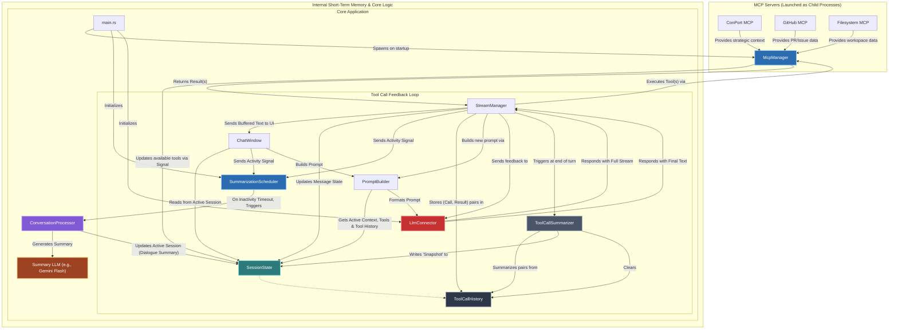

# Hobbes


Hobbes is a personal AI agent designed to assist its user. It features a clear separation between long-term strategic memory (MCP) and short-term conversational context.

## Key Features

- **Local-First:** All user data, including chat history and context, is stored locally and securely on the user's machine.
- **Clear Memory Separation:** The system maintains a clear distinction between long-term strategic memory (managed by external MCPs like ConPort) and short-term, session-specific active context (managed internally).
- **Reactive State Management:** Internal, short-term context is managed via Dioxus Signals, a reactive state management library. This allows for efficient, declarative updates to the UI and application state.

## Getting Started

This project is built with Dioxus and Rust.

> **Note on Porting:** This codebase is heavily optimized for macOS (using native APIs for Biometrics and Accessibility). While porting is encouraged, standard `cargo run` will likely fail without OS-specific adaptation or stripping of these features. Use the provided build scripts for the intended experience.

### Prerequisites
- Rust toolchain
- Dioxus CLI (`dx`)
- For production builds: Apple Developer certificate and provisioning profile

### Development Workflows

Hobbes has two primary development modes depending on what you are working on.

#### 1. UI & Frontend (Fast)
For iterating on the Dioxus UI, layout, and reactive state:
```bash
dx serve --platform desktop
```
*Note: Some system features (Touch ID, Keychain) may crash or fail in this mode due to missing entitlements.*

#### 2. Full System & Permissions (Robust)
**⚠️ The "Auth Black Hole" Warning:**
Hobbes uses advanced macOS features (Biometrics, Keychain, Local Entitlements) that are strictly sandboxed by the OS. Running via standard `cargo run` often results in **immediate crashes (`Killed: 9`)** because the binary lacks the necessary entitlements and embedded provisioning profile.

To run the full app with working permissions (Touch ID, Terminal, MCPs):
```bash
./scripts/dev_launcher.sh
```
This script packages a valid `.app` bundle, embeds your provisioning profile, and signs it, preventing the "Auth Black Hole" issues.

### Release Build

To build an unsigned release:

```bash
dx build --release
```

The app will be at `target/dx/Hobbes/release/macos/Hobbes.app`

### Production Build (Code Signed)

For production builds with biometric keychain access, use the build script:

```bash
./scripts/build_release.sh
```

This script:
1. Builds the release binary
2. Patches `Info.plist` with `NSFaceIDUsageDescription` for Touch ID
3. Embeds the provisioning profile
4. Code signs with your Developer certificate

> **Note:** Edit `scripts/build_release.sh` to set your own `IDENTITY` (signing certificate) before running.

## Architecture

The architecture is designed to integrate both external long-term memory and internal short-term memory seamlessly, with a robust feedback loop for handling tool calls. For a more detailed breakdown, please see [`ARCHITECTURE.md`](ARCHITECTURE.md).


```mermaid
graph TD
    subgraph "MCP Servers (Launched as Child Processes)"
        A[ConPort MCP] -- "Provides strategic context" --> L;
        B[GitHub MCP] -- "Provides PR/Issue data" --> L;
        C[Filesystem MCP] -- "Provides workspace data" --> L;
    end

    subgraph "Internal Short-Term Memory & Core Logic"
        subgraph "Core Application"
            M[main.rs] -->|Spawns on startup| L[McpManager];
            M -->|Initializes| SS[SummarizationScheduler];
            L -->|Updates available tools via Signal| F[SessionState];
            
            G[ChatWindow] -->|Reads from Active Session| F;
            G -->|Sends Activity Signal| SS;

            SS -->|On Inactivity Timeout, Triggers| J[ConversationProcessor];
            J -->|"Updates Active Session (Dialogue Summary)"| F;

            G -->|Builds Prompt| H[PromptBuilder];
            H -->|Gets Active Context, Tools & Tool History| F;
            M -->|Initializes| I[LlmConnector];
            H -->|Formats Prompt| I;

            J -- "Generates Summary" --> I2["Summary LLM (e.g., Gemini Flash)"];

            subgraph "Tool Call Feedback Loop"
                I -- "Responds with Full Stream" --> K[StreamManager];
                K -- "Executes Tool(s) via" --> L;
                L -- "Returns Result(s)" --> K;
                K -- "Sends Buffered Text to UI" --> G;
                K -- "Updates Message State" --> F;
                K -- "Sends Activity Signal" --> SS;
                K -- "Stores (Call, Result) pairs in" --> TCH[ToolCallHistory];
                K -- "Builds new prompt via" --> H;
                K -- "Sends feedback to" --> I;

                I -- "Responds with Final Text" --> K;
                K -- "Triggers at end of turn" --> TCS[ToolCallSummarizer];
                TCS -- "Summarizes pairs from" --> TCH;
                TCS -- "Writes 'Snapshot' to" --> F;
                TCS -- "Clears" --> TCH;
            end
        end
    end

    F -.-> TCH;
    style TCH fill:#2d3748,stroke:#a0aec0,stroke-width:2px,color:#fff
    style TCS fill:#4a5568,stroke:#a0aec0,stroke-width:2px,color:#fff
    style SS fill:#2b6cb0,stroke:#90cdf4,stroke-width:2px,color:#fff
    style J fill:#805ad5,stroke:#d6bcfa,stroke-width:2px,color:#fff
    style F fill:#2c7a7b,stroke:#81e6d9,stroke-width:2px,color:#fff
    style I fill:#c53030,stroke:#fc8181,stroke-width:2px,color:#fff
    style I2 fill:#9c4221,stroke:#fbd38d,stroke-width:2px,color:#fff
    style L fill:#2b6cb0,stroke:#90cdf4,stroke-width:2px,color:#fff
```

### Core Components

-   **Memory & State**:
    -   **Local Long-Term Memory (ConPort):** A local MCP providing access to the project's strategic memory (goals, decisions, etc.).
    -   **Short-Term Memory (`SessionState`):** The core of the "live" context, managed internally and stored securely in `sessions.json`. It holds messages, tool call history, and the active context for each conversation.
-   **Services & Processors**:
    -   **`McpManager`**: Manages the lifecycle of all MCP servers, launching them as child processes and discovering their available tools.
    -   **`StreamManager`**: Orchestrates the entire tool-call lifecycle, from detecting the LLM's request to executing the tool and feeding the result back in a robust feedback loop.
    -   **`ConversationProcessor`**: Summarizes dialogue using a dedicated Summary LLM to maintain conversational memory.
    -   **`ToolCallSummarizer`**: A dedicated service that creates concise "snapshots" of tool interactions for the active context after a tool loop concludes.

## Contributing

Please see [`CONTRIBUTING.md`](CONTRIBUTING.md) for details on how to contribute to the project.
