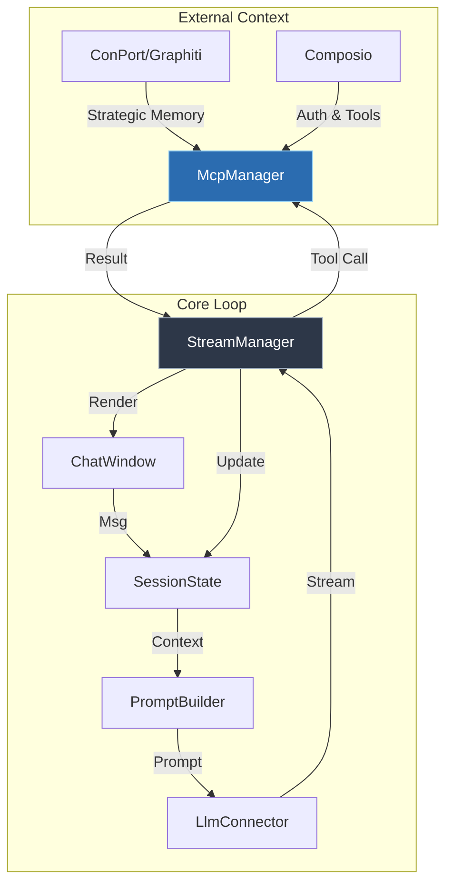

# Hobbes


## What is Hobbes?

**Hobbes is a private, local-first key-running AI assistant built in Rust and Dioxus, designed to master context composition.**

Unlike standard web chats that lose the thread after a few turns, Hobbes treats context as a composed product. It combines a "Safe Agent" philosophy with advanced memory architecture to keep your AI useful, grounded, and secure all day long.


### Why Hobbes?

-   **Context Composition**: Hobbes doesn't just "remember." It actively composes a "Memory Object" using a background Summary Model, allowing you to maintain a coherent workspace all day without hitting "New Chat."
-   **Local & Private**: All data is stored locally on your machine. We use Google's Generative API (or your provider of choice) *only* for inference. You own the prompt lifecycle.
-   **Native MCP & Composio**: Seamlessly integrates Model Context Protocol (MCP) tools. Connect to hundreds of apps (GitHub, Slack, etc.) via our custom [Composio](https://composio.dev/) integration without exposing keys to third-party wrappers.
-   **Advanced Reasoning**: Native support for Gemini 2.5/3.0 "Thinking" models with "The Baton Pattern" for maintaining thought signatures across turns.

---

## Getting Started

Hobbes is built with **Dioxus 0.6** and **Rust**.

### Prerequisites
-   Rust toolchain
-   Dioxus CLI (`dx`)

### Running Locally

For UI development and standard testing:

```bash
dx serve --platform desktop
```
*Note: Some macOS-specific features (like Biometric TouchID) may be disabled in this mode.*

### Production Build

To build the full release version:

```bash
dx build --release
```
The app will be located at `target/dx/Hobbes/release/macos/Hobbes.app`.

*(For signing and distribution workflows, see `scripts/build_release.sh`)*

---

## Architecture

Hobbes creates a robust feedback loop between the User, the LLM, and external Tools:


```mermaid
graph TD
    subgraph "External Context"
        A[ConPort/Graphiti] -- "Strategic Memory" --> L;
        B[Composio] -- "Auth & Tools" --> L;
    end

    subgraph "Core Loop"
        G[ChatWindow] -->|Msg| F[SessionState];
        F -->|Context| H[PromptBuilder];
        H -->|Prompt| I[LlmConnector];
        I -->|Stream| K[StreamManager];
        
        K -->|Tool Call| L[McpManager];
        L -->|Result| K;
        K -->|Update| F;
        K -->|Render| G;
    end
    
    style K fill:#2d3748,stroke:#a0aec0,color:#fff
    style L fill:#2b6cb0,stroke:#90cdf4,color:#fff
```

See [`ARCHITECTURE.md`](ARCHITECTURE.md) for a deep dive.

---

## Key Features

### 🧠 Advanced Memory Architecture
- **Context Composition**: Hobbes maintains a "Memory Object" that actively summarizes conversation threads. Chat all day in a single session without the AI forgetting the first message.
- **Strategic vs. Active Memory**: Distinct layers for long-term knowledge (Graphiti/ConPort integration) and short-term session context.
- **"The Baton" Pattern**: Preserves AI "Thinking" signatures across turns, allowing the model to self-correct and maintain complex reasoning chains.

### 🛠️ Integrations & Tools
- **Native Composio Support**: Connect to 100+ apps (GitHub, Slack, Google Calendar) via OAuth. Hobbes auto-discovers and manages these tools locally.
- **BYOA (Bring Your Own App)**: Security-first approach to credentials. Your API keys are stored in the macOS Keychain, not on our servers.
- **McpManager**: A robust local orchestra for the Model Context Protocol. Run any standard MCP server as a child process.
- **Dynamic Tool Selection**: Automatically identifies and loads the most relevant tools for the current context to optimize token usage.

### ⚡ Performance & UX
- **Desktop Native**: Built with Rust and Dioxus 0.6 for 60fps performance and low memory footprint.
- **"Thinking" UI**: First-class support for Gemini 2.5/3.0 reasoning models. Watch the model "think" in real-time with collapsible thought blocks.
- **Skill System**: Extend Hobbes with simple Markdown files. Define new "Skills" (sets of instructions and tools) that the agent can dynamically adopt.

### 🔒 Privacy & Security
- **Local-First**: Conversations and vector indices live on your SSD.
- **Unified Permission Lifecycle**: Every tool call and external request requires your explicit verification (unless you white-list it).
- **Audit Trails**: Clear logs of exactly what data was sent to the LLM and what tools were executed.

## Philosophy & Origin

Hobbes started as an experiment in **Context Composition**: *How do we make an AI that doesn't get dumber as the conversation gets longer?*

### AI-Native Development
Hobbes was built using an **AI-Augmented** workflow. We treat modern LLMs (Gemini, Claude) as "Pair Programmers" rather than magic wands. This allows us to:
1.  **Accelerate Learning**: Rapidly adopt new stacks like Dioxus and Rust.
2.  **Enforce Architecture**: Use AI to rigidly check against our `ARCHITECTURE.md` before every commit.
3.  **Maintain Quality**: Ensure every line of code is reviewed and understood by the human in the loop.

We believe this "Human-in-the-Loop" model is the future of software engineering—using AI to amplify capability, not replace understanding.

## License

Hobbes is released under the **Functional Source License (FSL 1.1)**.
-   **Free for personal and non-competing business use.**
-   **Converts to Apache 2.0 on 2028-01-20.**

We believe in open source sustainability. This model protects the project's ability to fund itself in the short term while guaranteeing a fully open future.

## ⚖️ EU AI Act & Territorial Use Restriction

Hobbes is an experimental, local-first software tool developed and incorporated in the State of Washington, USA. It operates on a "Bring Your Own Key" (BYOK) architecture and functions purely as a local user interface and memory manager.

By downloading, installing, or using Hobbes, you acknowledge and agree that:

1. **You are acting as the sole Deployer** of any AI models you choose to connect to this software.
2. **Hobbes is not intended for use within the European Union (EU)** or by EU citizens. We do not actively market, distribute, or support this software within the EU market.
3. If you access or use Hobbes from within the EU, you do so **entirely at your own risk** and assume full responsibility for compliance with all local laws, including the EU AI Act (Regulation (EU) 2024/1689), GDPR, and any downstream provider liabilities.
4. We **expressly disclaim any liability** for the outputs, data processing, or regulatory compliance of third-party API models connected to this software by the user.

## Contributing

Please see [`CONTRIBUTING.md`](CONTRIBUTING.md) for details on how to contribute.

---

*Authored by @dustmoo & The Clear Mirror Team*
