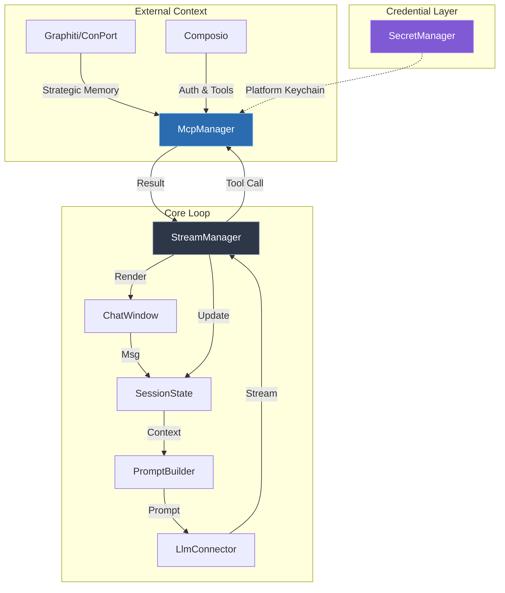

# SYSTEM_PATTERNS.md - Hobbes Beta Architecture & Critical Mandates

> **Version**: Beta (v0.9.x)  
> **Last Updated**: 2026-02-22

This document consolidates critical system patterns, anti-patterns, and architectural mandates for the Hobbes codebase. It serves as the authoritative reference for implementation patterns discovered through production experience.

---

## Architecture Overview

Hobbes creates a robust feedback loop between the User, LLM, and external Tools:



For detailed component documentation, see [ARCHITECTURE.md](ARCHITECTURE.md).

---

## Critical Mandates

These patterns are **non-negotiable** and their violation has caused production regressions.

### 1. Reactive Tool Synchronization

> **Pattern ID**: P-001  
> **Anti-Pattern**: Manual tool fetch in chat cycle

**NEVER** call `get_mcp_context().await` inside `send_message` or `PromptBuilder` cycles.

```rust
// ❌ ANTI-PATTERN: Causes stale state overwrites
let mcp_context = mcp_manager.read().get_mcp_context().await;
session.active_context.mcp_tools = Some(mcp_context);

// ✅ CORRECT: Trust the reactive sync
// McpManager maintains Signal → use_effect syncs to SessionState
```

**Why**: The `use_effect` in `ChatWindow` root already synchronizes the MCP context reactively. Manual fetches can skip "unload" updates or overwrite with stale data.

---

### 2. Composio OAuth Callback Pattern

> **Pattern ID**: P-002  
> **Anti-Pattern**: Missing callback_url

OAuth flows for Composio toolkits **MUST**:

1. Start local callback server on random port (30000-40000)
2. Include `callback_url` in the link request:
   ```rust
   serde_json::json!({
       "auth_config_id": auth_config_id, 
       "user_id": final_user_id,
       "callback_url": format!("http://localhost:{}/callback", port)
   })
   ```
3. Wait for Composio redirect to `http://localhost:{port}/callback`
4. Capture `connectedAccountId` from callback
5. Refresh connected accounts cache

**If broken**: OAuth completes on Composio side but app doesn't detect it.

---

### 3. Tool Names vs Toolkit Slugs

> **Pattern ID**: P-003  
> **Anti-Pattern**: Casing confusion

| Type | Casing | Example |
|------|--------|---------|
| **Tool Names** | UPPERCASE | `GMAIL_SEND_EMAIL` |
| **Toolkit Slugs** | Preserve API casing (usually lowercase) | `gmail` |

**Rules**:
- Cache toolkit slugs **exactly as Composio returns them**
- Use `.eq_ignore_ascii_case()` for matching
- Infer toolkit from tool name: `GMAIL_SEND_EMAIL` → `gmail`
- Auth config names (e.g., `mcp_gmail-mglu9n`) are **NOT** slugs

---

### 4. User-Filtered Account Caching

> **Pattern ID**: P-004  
> **Anti-Pattern**: Caching all accounts without filtering

Always filter connected accounts by target user **before** caching:

```rust
let target_id = self.entity_id.as_deref().or(self.user_id.as_deref());

let should_insert = match target_id {
    Some(target) => account.user_id == Some(target),
    None => true, // Fallback
};
```

**Location**: `src/mcp/composio_client.rs` → `cache_accounts`

**If broken**: User A uses User B's credentials; OAuth never triggers for User A.

---

### 5. Cross-Platform Credential Abstraction

> **Pattern ID**: P-005 (Beta)  
> **Implementation**: Conditional compilation

```rust
#[cfg(target_os = "macos")]
mod secret_manager;        // Keychain + Biometric

#[cfg(not(target_os = "macos"))]
mod secret_manager_generic; // keyring crate
```

**Rules**:
- Both modules expose identical public API
- Biometric methods are stubs on non-macOS
- Never import `keychain_ffi` directly from components—use `secret_manager`

---

## Anti-Pattern Registry

| ID | Name | Symptom | Fix |
|----|------|---------|-----|
| AP-001 | Manual MCP Fetch | Disappearing tools, stale context | Use reactive sync only |
| AP-002 | Missing callback_url | OAuth hangs, toolkit limbo | Include callback in link request |
| AP-003 | Uppercase Toolkit Slugs | Gmail/Slack auth fails | Preserve API casing |
| AP-004 | Unfiltered Account Cache | Wrong credentials used | Filter by user_id |
| AP-005 | Direct keychain_ffi Import | Cross-platform build fails | Use secret_manager module |
| AP-006 | Direct Keychain Save Bypass | Duplicated fallback logic, inconsistent behavior | Use `save_secret_to_keychain()` or `SecretManager::set()` |
| AP-007 | Reversed MCP Lock Order | App deadlock (hangs forever) | Always lock `servers` before `dynamic_local_tools` |

---

## Pattern References

For deeper documentation on specific subsystems:

| Topic | Document |
|-------|----------|
| Full Architecture | [ARCHITECTURE.md](ARCHITECTURE.md) |
| Composio API Surface | [COMPOSIO_ENDPOINTS.md](COMPOSIO_ENDPOINTS.md) |
| Security & Credentials | [SECURITY.md](SECURITY.md) |
| macOS Signing | [GUIDE_TO_APPLE_SIGNING.md](GUIDE_TO_APPLE_SIGNING.md) |
| Contributing | [CONTRIBUTING.md](CONTRIBUTING.md) |

---

*This document supersedes `memory-bank/systemPatterns.md` as of Beta release.*

---

## Patterns Added in v0.9.53

### 6. Auth Recovery — 6-Point Reconnect Lifecycle

> **Pattern ID**: P-006  
> **Replaces**: Ad-hoc self-repair in `execution.rs` (deprecated)

When a tool call fails with 401/403, the system runs a full 6-point reconnect:
1.  **Hydrate `auth_config_cache`** via `list_auth_configs`
2.  **Resolve `auth_config_id`** (cache → API → create)
3.  **Delete stale ACTIVE connections** + bust `toolkit_account_map`
4.  **Initiate OAuth** with `force=true` (bypasses ACTIVE safety check)
5.  **Re-patch MCP server** to ensure toolkit + auth_config binding
6.  **Re-hydrate `toolkit_account_map`** via `list_connected_accounts`

> [!IMPORTANT]
> Step 6 is critical. Step 3 busts the cache entry, and without Step 6 the next tool call's
> proactive check sees an empty cache, concludes there's no connection, and fires another
> reconnect — destroying the brand-new credentials.

After successful re-auth, `try_auth_recovery()` returns `is_error: Some(false)` to let the LLM pace the retry. Internal retries are an **anti-pattern** (see below).

> [!WARNING]
> **Anti-Patterns** (confirmed Feb 2026):
> - **Internal retry after reconnect**: Immediate retry hits proxy before token propagates → 401 → infinite browser loop
> - **Fallthrough after proactive reconnect**: Same issue — executes tool before token syncs → 401 → `try_auth_recovery` fires second reconnect
> - **Case-sensitive cache keys**: `toolkit_account_map` keys must be **lowercase**. API slug casing varies between endpoints.

**Location**: `src/mcp/composio_client/mod.rs` → `reconnect_toolkit()`, `src/mcp/manager.rs` → `try_auth_recovery()`

---

### 7. Single-Authority Auth Detection

> **Pattern ID**: P-007  
> **Replaces**: Duplicated substring matching in `execution.rs` and `manager.rs` (deprecated)

All auth error detection is centralized in `ToolExecuteResponse::is_auth_error()` covering 6 patterns: `status_code`, `statusCode`, `ECODE`, `http_error`, nested `data.data`, and error string fallback.

**Location**: `src/mcp/composio_client/models.rs`  
**If broken**: Auth failures silently pass through without triggering recovery.

---

### 8. Dynamic Tool Injection (OnDemand Mode)

> **Pattern ID**: P-008  
> **Anti-Pattern**: Loading all 200+ tools upfront into every Gemini request

`COMPOSIO_GET_APP_TOOLS` discovers tools, deduplicates, applies budget-aware selection (capped at `GEMINI_TOOL_LIMIT = 128`), and injects into `dynamic_composio_tools` cache as native `rmcp::Tool` objects.

`COMPOSIO_CLEAR_TOOLS` flushes the cache. `build_mcp_context()` includes dynamic cache as a virtual server.

**Location**: `src/mcp/manager.rs`

---

### 9. Serialize-Then-Move Persistence

> **Pattern ID**: P-009  
> **Replaces**: Clone-based `save_async(state: SessionState)` (deprecated)

**NEVER** clone `SessionState` for async saves. Serialize to `Vec<u8>` on the calling thread, move only the bytes to background I/O.

```rust
// ❌ DEPRECATED: Deep clone of all sessions + messages
SessionState::save_async(state.clone(), None);

// ✅ CORRECT: Borrow, serialize, move bytes
SessionState::save_async(&state, None);

// ✅ CORRECT: After releasing a write guard on a Signal
SessionState::save_signal(&session_state, None);
```

**Location**: `src/session.rs`, `src/async_persist.rs`

---

### 10. MCP Lock Ordering Invariant

> **Pattern ID**: P-010  
> **Anti-Pattern**: Reversed lock acquisition (ABBA deadlock)

When acquiring multiple MCP manager locks, always follow this order:

```
servers → dynamic_local_tools → dynamic_composio_tools
```

`call_tool` acquires `servers` first (line ~1655), then falls back to `dynamic_local_tools` (line ~1762). Any function that needs both locks must acquire them in the same order.

**If broken**: ABBA deadlock — app hangs permanently when a user switches a server mode while a tool call is in-flight.

---

### 11. Centralized Keychain Save Helper

> **Pattern ID**: P-011  
> **Anti-Pattern**: Direct `keychain_ffi` calls from UI components (AP-006)

All keychain save operations must use `SecretManager::set()` or the standalone `save_secret_to_keychain()` helper. Never call `set_generic_password_with_biometric_protection` / `set_generic_password_local` / `set_generic_password` directly from components.

```rust
// ❌ ANTI-PATTERN: Duplicated fallback logic in each component
keychain_ffi::set_generic_password_with_biometric_protection(key, value)
    .or_else(|e| { /* fallback logic */ });

// ✅ CORRECT: Single source of truth
crate::secret_manager::save_secret_to_keychain(key, value, use_biometric)
```

**Location**: `src/secret_manager.rs` → `save_secret_to_keychain()`
