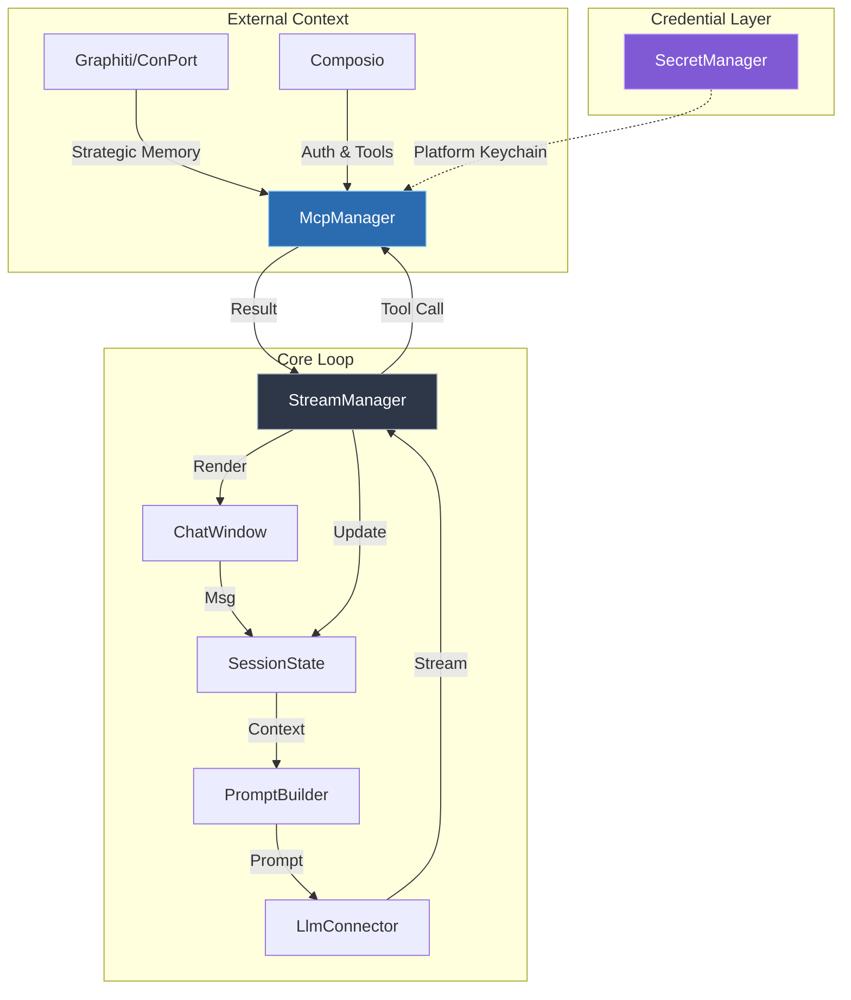

# SYSTEM_PATTERNS.md - Hobbes Beta Architecture & Critical Mandates

> **Version**: Beta (v0.9.x)  
> **Last Updated**: 2026-02-01

This document consolidates critical system patterns, anti-patterns, and architectural mandates for the Hobbes codebase. It serves as the authoritative reference for implementation patterns discovered through production experience.

---

## Architecture Overview

Hobbes creates a robust feedback loop between the User, LLM, and external Tools:



For detailed component documentation, see [ARCHITECTURE.md](ARCHITECTURE.md).

---

## Critical Mandates

These patterns are **non-negotiable** and their violation has caused production regressions.

### 1. Reactive Tool Synchronization

> **Pattern ID**: P-001  
> **Anti-Pattern**: Manual tool fetch in chat cycle

**NEVER** call `get_mcp_context().await` inside `send_message` or `PromptBuilder` cycles.

```rust
// ❌ ANTI-PATTERN: Causes stale state overwrites
let mcp_context = mcp_manager.read().get_mcp_context().await;
session.active_context.mcp_tools = Some(mcp_context);

// ✅ CORRECT: Trust the reactive sync
// McpManager maintains Signal → use_effect syncs to SessionState
```

**Why**: The `use_effect` in `ChatWindow` root already synchronizes the MCP context reactively. Manual fetches can skip "unload" updates or overwrite with stale data.

---

### 2. Composio OAuth Callback Pattern

> **Pattern ID**: P-002  
> **Anti-Pattern**: Missing callback_url

OAuth flows for Composio toolkits **MUST**:

1. Start local callback server on random port (30000-40000)
2. Include `callback_url` in the link request:
   ```rust
   serde_json::json!({
       "auth_config_id": auth_config_id, 
       "user_id": final_user_id,
       "callback_url": format!("http://localhost:{}/callback", port)
   })
   ```
3. Wait for Composio redirect to `http://localhost:{port}/callback`
4. Capture `connectedAccountId` from callback
5. Refresh connected accounts cache

**If broken**: OAuth completes on Composio side but app doesn't detect it.

---

### 3. Tool Names vs Toolkit Slugs

> **Pattern ID**: P-003  
> **Anti-Pattern**: Casing confusion

| Type | Casing | Example |
|------|--------|---------|
| **Tool Names** | UPPERCASE | `GMAIL_SEND_EMAIL` |
| **Toolkit Slugs** | Preserve API casing (usually lowercase) | `gmail` |

**Rules**:
- Cache toolkit slugs **exactly as Composio returns them**
- Use `.eq_ignore_ascii_case()` for matching
- Infer toolkit from tool name: `GMAIL_SEND_EMAIL` → `gmail`
- Auth config names (e.g., `mcp_gmail-mglu9n`) are **NOT** slugs

---

### 4. User-Filtered Account Caching

> **Pattern ID**: P-004  
> **Anti-Pattern**: Caching all accounts without filtering

Always filter connected accounts by target user **before** caching:

```rust
let target_id = self.entity_id.as_deref().or(self.user_id.as_deref());

let should_insert = match target_id {
    Some(target) => account.user_id == Some(target),
    None => true, // Fallback
};
```

**Location**: `src/mcp/composio_client.rs` → `cache_accounts`

**If broken**: User A uses User B's credentials; OAuth never triggers for User A.

---

### 5. Cross-Platform Credential Abstraction

> **Pattern ID**: P-005 (Beta)  
> **Implementation**: Conditional compilation

```rust
#[cfg(target_os = "macos")]
mod secret_manager;        // Keychain + Biometric

#[cfg(not(target_os = "macos"))]
mod secret_manager_generic; // keyring crate
```

**Rules**:
- Both modules expose identical public API
- Biometric methods are stubs on non-macOS
- Never import `keychain_ffi` directly from components—use `secret_manager`

---

## Anti-Pattern Registry

| ID | Name | Symptom | Fix |
|----|------|---------|-----|
| AP-001 | Manual MCP Fetch | Disappearing tools, stale context | Use reactive sync only |
| AP-002 | Missing callback_url | OAuth hangs, toolkit limbo | Include callback in link request |
| AP-003 | Uppercase Toolkit Slugs | Gmail/Slack auth fails | Preserve API casing |
| AP-004 | Unfiltered Account Cache | Wrong credentials used | Filter by user_id |
| AP-005 | Direct keychain_ffi Import | Cross-platform build fails | Use secret_manager module |

---

## Pattern References

For deeper documentation on specific subsystems:

| Topic | Document |
|-------|----------|
| Full Architecture | [ARCHITECTURE.md](ARCHITECTURE.md) |
| Composio API Surface | [COMPOSIO_ENDPOINTS.md](COMPOSIO_ENDPOINTS.md) |
| Security & Credentials | [SECURITY.md](SECURITY.md) |
| macOS Signing | [GUIDE_TO_APPLE_SIGNING.md](GUIDE_TO_APPLE_SIGNING.md) |
| Contributing | [CONTRIBUTING.md](CONTRIBUTING.md) |

---

*This document supersedes `memory-bank/systemPatterns.md` as of Beta release.*
