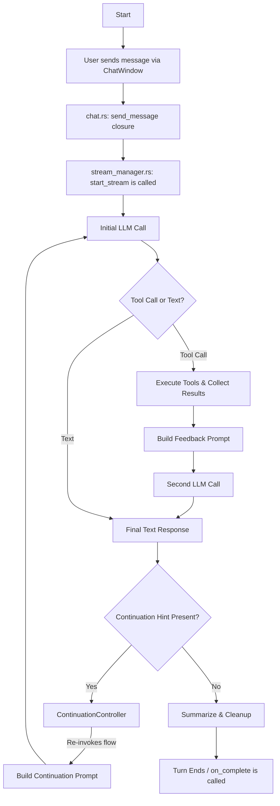

# Tool Flow Fix Plan: AI-Initiated Conversation Continuation

This document outlines the architectural changes required to allow the AI to continue a conversation even if its last message was a statement, not a question or a tool call.

## 1. Problem Analysis

The current chat lifecycle, orchestrated by `StreamManager`, is designed for a single, user-initiated turn. The process is as follows:

1.  `ChatWindow` calls `StreamManager::start_stream` when the user sends a message.
2.  A master async task is spawned to handle the entire request/response flow.
3.  This task makes one or more calls to the LLM (one initial, and subsequent calls for tool feedback).
4.  Once the final text response is received from the LLM and streamed to the UI, the master task cleans up, saves the session, and calls an `on_complete` callback.
5.  The lifecycle for that turn is now finished and awaits new user input.

The key issue is that the process terminates. There is no mechanism to re-engage the `StreamManager` if the AI's response implies a continuation.

## 2. Proposed Solution: The "Continuation" Signal

We will introduce a new, explicit signal to indicate when the AI should continue the conversation. This avoids complex, potentially brittle logic that tries to infer continuation from the AI's language.

### Architectural Changes

We will introduce a new component and modify the `StreamManager` to handle a "continuation" state. This simplified diagram illustrates the proposed control flow.

### Component Responsibilities:

*   **`StreamManager` (Modified):**
    *   Will be responsible for checking the final LLM output for a special "continuation hint" (e.g., a simple XML tag like `<continue />`).
    *   If the hint is found, it will **not** call the `on_complete` callback. Instead, it will trigger the new `ContinuationController`.
*   **`ContinuationController` (New Component/Service):**
    *   A new service responsible for orchestrating the re-invocation of the chat flow.
    *   It will call the `send_prompt_to_llm` closure (or a new variant of it) with the updated conversation context but no new user message.
*   **`PromptBuilder` (Modified):**
    *   Will be updated to handle calls for continuation where the user message is empty. It will inject a specific instruction into the system prompt, such as, "You are the last one to have spoken. Continue the conversation."

## 3. Code Review Findings (`chat.rs`)

A review of `src/components/chat.rs` confirms the architectural analysis.

-   **`send_prompt_to_llm` Closure:** This is the key function that invokes `stream_manager.start_stream`.
-   **`on_complete` Callback:** The mechanism for terminating the chat turn is an `on_complete` closure passed into `start_stream`. This closure sends a signal on a one-shot channel, which the calling task awaits. Once the signal is received, the `is_sending` flag is set to `false`, and the turn ends.

This confirms that our proposed solution is viable. We can modify `StreamManager` to conditionally call `on_complete` or, alternatively, trigger the new `ContinuationController` based on the presence of a continuation hint in the LLM's final response.

## 4. Finalized Plan

The plan is approved. The next step is to move to the implementation phase, which will involve:

1.  Creating a new `ContinuationController` service/component.
2.  Modifying `StreamManager` to detect the continuation hint and call the `ContinuationController` instead of `on_complete`.
3.  Modifying `chat.rs` to provide the `ContinuationController` with a way to re-invoke the `send_prompt_to_llm` closure.
4.  Modifying `PromptBuilder` to handle an empty user message and inject the "continue the conversation" instruction.
