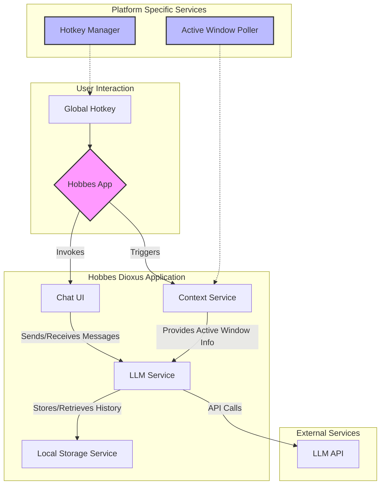

# System Patterns: Hobbes MVP Architecture

This document contains the high-level architecture for the Hobbes Minimum Viable Product (MVP).



## Critical: Composio OAuth Callback Pattern

**NEVER REMOVE THIS PATTERN** - OAuth flows for Composio toolkits MUST:

1. Start a local callback server on a random available port (30000-40000)
2. Send `callback_url` to Composio's `/connected_accounts/link` API (per [Composio docs](https://docs.composio.dev/docs/authenticating-tools)):
   ```rust
   let payload = serde_json::json!({
       "auth_config_id": auth_config_id, 
       "user_id": final_user_id,
       "callback_url": format!("http://localhost:{}/callback", port)  // CRITICAL!
   });
   ```
3. Wait for Composio to redirect back to `http://localhost:{port}/callback` after user completes OAuth
4. The callback server captures the `connectedAccountId` or success status
5. Refresh connected accounts cache after successful auth

**If this pattern is broken, OAuth will complete on Composio's side but the app won't know, leaving toolkits in limbo.**

## Critical: Composio Tool Names vs Toolkit Slugs

**NEVER CONFUSE THESE** - Composio has distinct naming conventions:

### Tool Names (UPPERCASE)
- Tool names are **ALWAYS UPPERCASE** when calling tools
- Example: `GMAIL_SEND_EMAIL`, `CLICKUP_CREATE_TASK`, `GITHUB_LIST_STARGAZERS`
- Used in: `composio.tools.execute("GMAIL_SEND_EMAIL", ...)`

### Toolkit Slugs (preserve API casing)
- Toolkit slugs **preserve casing as returned from Composio API**
- Typically lowercase: `gmail`, `clickup`, `github`
- Found in: `tool.toolkit.slug`, connected account mappings
- **NEVER force to uppercase** - store as-is from API

### Implementation Rules
1. **Cache toolkit slugs** exactly as Composio returns them
2. **Use case-insensitive lookups** when matching (`.eq_ignore_ascii_case()`)
3. **Infer toolkit from tool name** using lowercase (e.g., `GMAIL_SEND_EMAIL` → `gmail`)
4. **Auth config names** (e.g., `mcp_gmail-mglu9n`) are NOT slugs - ignore them for matching

**If you force uppercase on toolkit slugs, Gmail breaks. If you force lowercase on tool names, execution fails.**

## Critical: Composio Account Caching Must Filter by User

**NEVER CACHE ACCOUNTS WITHOUT USER FILTERING** - When caching connected accounts:

### The Problem
Composio's `/connected_accounts` API returns ALL accounts across ALL users (when queried with a user_id, it still may return accounts from other users in the workspace). If you cache accounts by toolkit slug alone, you'll cache the FIRST account that matches, which may belong to a different user.

### Symptoms
- OAuth doesn't trigger when it should
- Tool execution uses wrong user's credentials
- One toolkit works (ClickUp) but another fails (Gmail)

### The Fix
**Always filter by target user BEFORE caching:**

```rust
let target_id = self.entity_id.as_deref().or(self.user_id.as_deref());

let should_insert = if let Some(target) = target_id {
    // ONLY insert if account belongs to our target user
    if account.user_id != Some(target) {
        false  // Skip this account
    } else {
        true   // User matches, cache it
    }
} else {
    true  // No target, accept any (fallback)
};
```

### Implementation Location
- File: `src/mcp/composio_client.rs`
- Function: `cache_accounts`
- Logic: Filter accounts by `user_id` match before inserting into `toolkit_account_map`

**If you cache without filtering, user A will use user B's credentials, and OAuth will never trigger for user A.**