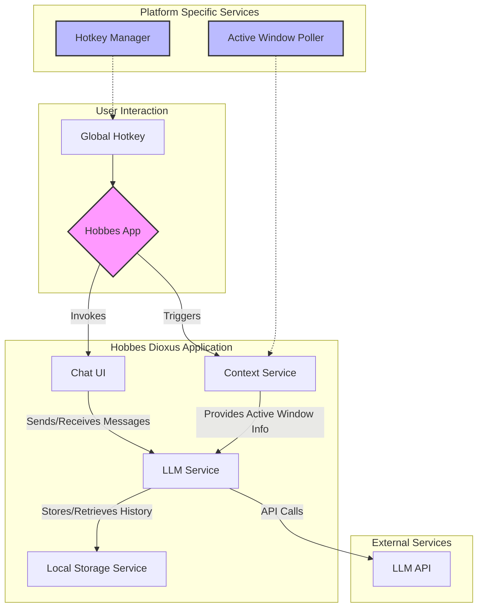

# Task: Implement Hobbes MVP Core Assistant

This task covers the end-to-end implementation of the Hobbes Minimum Viable Product (MVP). The goal is to build the core local-first assistant, including hotkey invocation, context capture, a chat UI, LLM integration, and local history.

## Success Criteria

-   The application runs as a menu bar/system tray icon.
-   A global hotkey toggles the visibility of the main application window.
-   When the hotkey is pressed, the title of the currently active window is captured.
-   The user can interact with an LLM through a chat interface.
-   Conversations are saved to and loaded from a local file.
-   All components are integrated and function correctly together.
-   The UI design follows best practices for a smooth and intuitive user experience.

## MVP Architecture

## Implementation Plan

-   [ ] **1. Project Setup:** Initialize a new Dioxus project configured for cross-platform desktop development (macOS and Windows).
-   [ ] **2. Application Shell:** Create the main application entry point that runs as a menu bar/system tray icon and manages a basic, toggleable window.
-   [ ] **3. Chat UI:** Develop the user interface for the chat window using Dioxus components, including message display and a text input area.
-   [ ] **4. Local Storage Service:** Implement the service in Rust to save and load chat history from a local file (e.g., JSON).
-   [ ] **5. LLM Service:** Implement the core service in Rust to handle API communication with the language model, including prompt construction and persona management.
-   [ ] **6. UI Integration:** Connect the Chat UI to the Local Storage and LLM services so that conversations can be displayed and new messages can be sent.
-   [ ] **7. Native Hotkey Manager:** Implement the platform-specific code to register a global hotkey that toggles the chat window's visibility.
-   [ ] **8. Native Context Service:** Implement the platform-specific code to capture the active window's title when the hotkey is invoked.
-   [ ] **9. Final Integration & Testing:** Integrate the native services with the core application and perform end-to-end testing to ensure all success criteria are met.